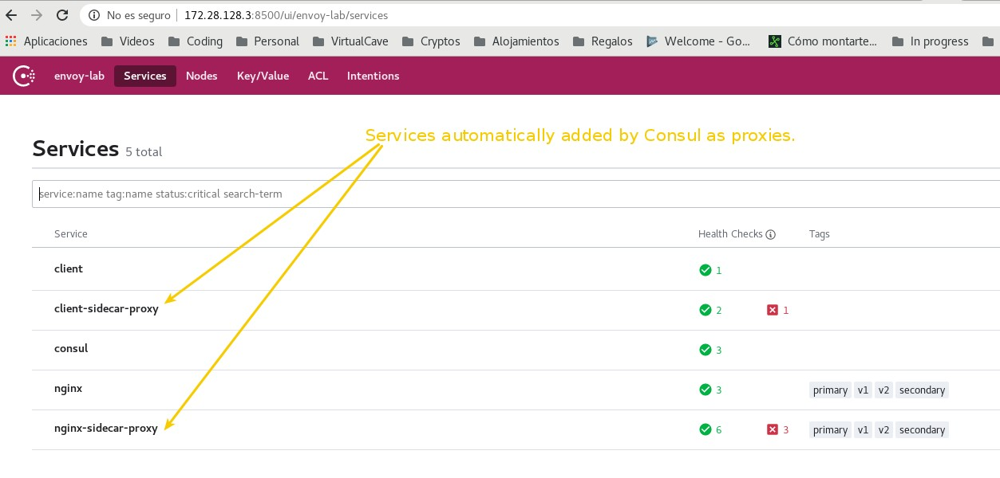
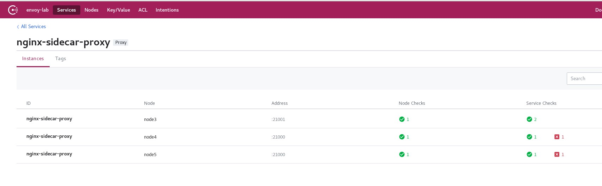
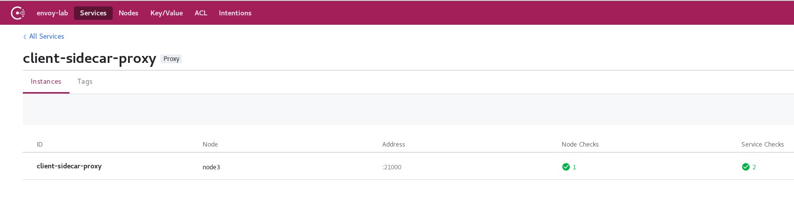

# Lab2: Integrating Envoy and Consul

In this lab you will run:

* A _[Consul](https://www.consul.io/)_ cluster with two registered services: a) _nginx_, b) _client_.
* An _[Envoy](https://www.envoyproxy.io/)_ proxy for the _nginx_ _[Consul](https://www.consul.io/)_ service.
* An _[Envoy](https://www.envoyproxy.io/)_ proxy for the _client_ _[Consul](https://www.consul.io/)_ service.

# Lab Goal

In this lab you'll practice how to configure _[Consul](https://www.consul.io/)_ to use _[Envoy](https://www.envoyproxy.io/)_ proxy in order to communicate two services. Usually _[Consul](https://www.consul.io/)_ can be used as a control plane in combination with its [Connect](https://www.consul.io/docs/connect/index.html) features.

Also you'll see how _[Consul Connect](https://www.consul.io/)_ is used to generate a boostrap configuration for _[Envoy](https://www.envoyproxy.io/)_.

After this lab you will have a better understanding on how _[Envoy](https://www.envoyproxy.io/)_ data plane is configured and how _[Consul](https://www.consul.io/)_ may be used as its control plane.

# Requirements

You will need to prepare configuration files for each node to run _Consul_ and _Envoy_.
To do this you may use the configuration files provided in this lab.

Please keep in mind that even it's possible to prepare all of this stuff automatically, the main goal of this lab is getting used to configure and run these tools. This will help you to have a better understanding of what's happening under the hoods.

# Preliminar explanations

_[Envoy](https://www.envoyproxy.io/)_ allows dynamic configuration using its xDS configuration API as explained in [this link](https://www.envoyproxy.io/docs/envoy/latest/intro/arch_overview/operations/dynamic_configuration).

_[Consul](https://www.consul.io/)_ and _[Envoy](https://www.envoyproxy.io/)_ talk to each other using [gRPC](https://grpc.io/). Specifically _[Consul](https://www.consul.io/)_ uses the _Aggregated xDS (a.k.a. ADS)_. This is a core key to understand how these softwares integrate each other.

# Configuring Consul

To configure _[Consul](https://www.consul.io/)_ you should _SSH_ into the nodes and modify a few files.

Once you login into one node you will find:

* The contents of this repository in the */home/vagrant/configuration_for_labs*.
* Configuration for _[Consul](https://www.consul.io/)_ at */home/vagrant/configuration_for_labs/lab2_integrating_consul_and_envoy/consul/config*.
* _[Consul](https://www.consul.io/)_ binary located at */opt/consul/bin/consul*.

Go to the  *[/home/vagrant/configuration_for_labs/lab2_integrating_consul_and_envoy/consul/config/main.hcl](./consul/config/main.hcl)* file and change the following directives:

* _bind_addr_: you need to set the IP address to the one assigned to the node. For example, for node-3 it should be 172.28.128.3.
* _addresses->http_: you need to set the IP address to the one assigned to the node. For example, for node-3 it should be 172.28.128.3.
* *node_name*: you should use a value _"node3"_ for node-3.
* *start_join*: update it with all nodes IP addresses. You only need to update these values if you changed the number of nodes in the _Vagrantfile_.
* *retry_join*: update it with all nodes IP addresses. You only need to update these values if you changed the number of nodes in the _Vagrantfile_.

## Services configured in this lab

You will configure two services using _[Consul](https://www.consul.io/)_ configuration files:

* _nginx_ service: to register the _[Nginx](https://www.nginx.com/)_ web server.
* _client_ service: to register a fake service used to connect to the _nginx_ service.

And also, these configurations will register their proxies automatically as:

* _nginx-sidecar-proxy_: this service represents the _[Nginx](https://www.nginx.com/)_ sidecar proxy configured in _[Envoy](https://www.envoyproxy.io/)_.
* _client-sidecar-proxy_: this services represents the _client_ sidecar proxy configured in _[Envoy](https://www.envoyproxy.io/)_

These proxy services are generated automatically by _[Consul](https://www.consul.io/)_ when you configure [Consul Connect](https://www.consul.io/docs/connect/index.html).

## main.hcl configuration for **node-3**

Using the default values from this repository you should have a configuration like this for each node.

```bash
[vagrant@localhost ~]$ cat /opt/consul/config/main.hcl 
datacenter = "envoy-lab"
server = true
bind_addr = "172.28.128.3"
ports {
  grpc = 8502
}
addresses {
  http = "172.28.128.3"
}
data_dir = "/opt/consul/lib"
log_file = "/opt/consul/logsconsul.log"
node_name = "node3"
bootstrap_expect = 3
start_join = ["172.28.128.3","172.28.128.4","172.28.128.5"]
retry_join = ["172.28.128.3","172.28.128.4","172.28.128.5"]
connect {
  enabled = true
}
```

## main.hcl configuration for **node-4**

```bash
[vagrant@localhost ~]$ cat /opt/consul/config/main.hcl 
datacenter = "envoy-lab"
server = true
bind_addr = "172.28.128.4"
ports {
  grpc = 8502
}
addresses {
  http = "172.28.128.4"
}
data_dir = "/opt/consul/lib"
log_file = "/opt/consul/logs/consul.log"
node_name = "node4"
bootstrap_expect = 3
start_join = ["172.28.128.3","172.28.128.4","172.28.128.5"]
retry_join = ["172.28.128.3","172.28.128.4","172.28.128.5"]
connect {
  enabled = true
}
```

## main.hcl configuration for **node-5**

```bash
[vagrant@localhost ~]$ cat /opt/consul/config/main.hcl 
datacenter = "envoy-lab"
server = true
bind_addr = "172.28.128.5"
ports {
  grpc = 8502
}
addresses {
  http = "172.28.128.5"
}
data_dir = "/opt/consul/lib"
log_file = "/opt/consul/logs/consul.log"
node_name = "node5"
bootstrap_expect = 3
start_join = ["172.28.128.3","172.28.128.4","172.28.128.5"]
retry_join = ["172.28.128.3","172.28.128.4","172.28.128.5"]
connect {
  enabled = true
}
```

Now you may copy this configurations into the right folder which should be */opt/consul/config*. Use the commands below in each node:

```bash
# Copy the configurations files to Consul folder.
[vagrant@localhost config]$ cp -r /home/vagrant/configuration_for_labs/lab2_integrating_consul_and_envoy/consul/config/* /opt/consul/config/

# Verify that the files have been copied.
[vagrant@localhost ~]$ ls /opt/consul/config/
main.hcl  services
```

## Explanation of main.hcl

Here you have an explanation line by line of the _main.hcl_ configuration file.

```bash
 1	datacenter = "envoy-lab"
 2	server = true
 3	bind_addr = "172.28.128.3"
 4	ports {
 5	  grpc = 8502
 6	}
 7	addresses {
 8	  http = "172.28.128.3"
 9	}
10	data_dir = "/opt/consul/lib"
11	log_file = "/opt/consul/logsconsul.log"
12	node_name = "node3"
13	bootstrap_expect = 3
14	start_join = ["172.28.128.3","172.28.128.4","172.28.128.5"]
15	retry_join = ["172.28.128.3","172.28.128.4","172.28.128.5"]
16	connect {
17	  enabled = true
18	}
```

Line by line explanation:

```bash
# datacenter: Name of the _[Consul](https://www.consul.io/)_ datacenter.
 1	datacenter = "envoy-lab"

 # server: Set node as a _server_ node.
 2	server = true

 # bind_addr: IP address of the current node to bind Consul service.
 3	bind_addr = "172.28.128.3"

 # ports: Object to specify which ports and services are running.
 # _grpc_ is compulsory if you want to activate Envoy integration.
 4	ports {
 5	  grpc = 8502
 6	}

 # Addresses: IP address where the _http_ Consul service is bind.
 7	addresses {
 8	  http = "172.28.128.3"
 9	}

 # data_dir: Folder to store Consul runtime data.
10	data_dir = "/opt/consul/lib"

# log_file: Consul logs.
11	log_file = "/opt/consul/logsconsul.log"

# node_name: Consul node name. This is used to identify the node into the Consul cluster.
12	node_name = "node3"

# bootstrap_expect: used to set the minimum number of nodes needed to reach the first consensus in the cluster.
13	bootstrap_expect = 3

# start_join: list of node addresses to connect at start time. This is used to join the cluster when Consul boots.
14	start_join = ["172.28.128.3","172.28.128.4","172.28.128.5"]

# retry_join: list of node addresses to connect in case this node loses connection to the cluster.
15	retry_join = ["172.28.128.3","172.28.128.4","172.28.128.5"]

# connect: used to configure Consul Connect features. In this case is used to enable the Connect feature.
16	connect {
17	  enabled = true
18	}
```

# Running Consul

Now that you have configured _[Consul](https://www.consul.io/)_ you may start the cluster.
Please note that running the commands below will execute _[Consul](https://www.consul.io/)_ in foreground. Meaning that the shell will be blocked by the _[Consul](https://www.consul.io/)_ process. You may run it in background if you feel comfortable enough.

## Run Consul in node-3

```bash
[vagrant@localhost ~]$ /opt/consul/bin/consul agent -ui -config-file /opt/consul/config/main.hcl -config-dir /opt/consul/config/services/
bootstrap_expect > 0: expecting 3 servers
==> Starting Consul agent...
           Version: 'v1.7.2'
           Node ID: '67aae0e2-3545-4641-ea61-21696bda8704'
         Node name: 'node3'
        Datacenter: 'envoy-lab' (Segment: '<all>')
            Server: true (Bootstrap: false)
       Client Addr: [127.0.0.1] (HTTP: 8500, HTTPS: -1, gRPC: 8502, DNS: 8600)
      Cluster Addr: 172.28.128.3 (LAN: 8301, WAN: 8302)
           Encrypt: Gossip: false, TLS-Outgoing: false, TLS-Incoming: false, Auto-Encrypt-TLS: false

==> Log data will now stream in as it occurs:

    2020-04-10T19:18:02.695Z [INFO]  agent.server.raft: initial configuration: index=0 servers=[]
    2020-04-10T19:18:02.697Z [INFO]  agent.server.serf.wan: serf: EventMemberJoin: node3.envoy-lab 172.28.128.3
    2020-04-10T19:18:02.698Z [INFO]  agent.server.serf.lan: serf: EventMemberJoin: node3 172.28.128.3
    2020-04-10T19:18:02.702Z [INFO]  agent.server.raft: entering follower state: follower="Node at 172.28.128.3:8300 [Follower]" leader=
    2020-04-10T19:18:02.702Z [INFO]  agent.server: Adding LAN server: server="node3 (Addr: tcp/172.28.128.3:8300) (DC: envoy-lab)"
    2020-04-10T19:18:02.703Z [INFO]  agent.server: Handled event for server in area: event=member-join server=node3.envoy-lab area=wan
    2020-04-10T19:18:02.703Z [INFO]  agent: Started DNS server: address=127.0.0.1:8600 network=tcp
    2020-04-10T19:18:02.703Z [INFO]  agent: Started DNS server: address=127.0.0.1:8600 network=udp
    2020-04-10T19:18:02.704Z [INFO]  agent: Started HTTP server: address=172.28.128.3:8500 network=tcp
    2020-04-10T19:18:02.705Z [INFO]  agent: Started gRPC server: address=127.0.0.1:8502 network=tcp
    2020-04-10T19:18:02.705Z [INFO]  agent: Retry join is supported for the following discovery methods: cluster=LAN discovery_methods="aliyun aws azure digitalocean gce k8s linode mdns os packet scaleway softlayer tencentcloud triton vsphere"
    2020-04-10T19:18:02.705Z [INFO]  agent: Joining cluster...: cluster=LAN
    2020-04-10T19:18:02.705Z [INFO]  agent: (LAN) joining: lan_addresses=[172.28.128.3, 172.28.128.4, 172.28.128.5]
==> Joining cluster...
    2020-04-10T19:18:02.705Z [INFO]  agent: (LAN) joining: lan_addresses=[172.28.128.3, 172.28.128.4, 172.28.128.5]
    2020-04-10T19:18:02.707Z [INFO]  agent.server.serf.lan: serf: EventMemberJoin: node4 172.28.128.4
    2020-04-10T19:18:02.707Z [INFO]  agent.server.serf.lan: serf: EventMemberJoin: node5 172.28.128.5
    2020-04-10T19:18:02.708Z [INFO]  agent.server: Adding LAN server: server="node4 (Addr: tcp/172.28.128.4:8300) (DC: envoy-lab)"
    2020-04-10T19:18:02.711Z [INFO]  agent: (LAN) joined: number_of_nodes=3
    2020-04-10T19:18:02.711Z [INFO]  agent: Join cluster completed. Synced with initial agents: cluster=LAN num_agents=3
    2020-04-10T19:18:02.724Z [INFO]  agent: (LAN) joined: number_of_nodes=3
    2020-04-10T19:18:02.724Z [INFO]  agent: Join completed. Initial agents synced with: agent_count=3
    2020-04-10T19:18:02.724Z [INFO]  agent: started state syncer
==> Consul agent running!
    2020-04-10T19:18:02.727Z [INFO]  agent.server.serf.wan: serf: EventMemberJoin: node5.envoy-lab 172.28.128.5
    2020-04-10T19:18:02.727Z [INFO]  agent.server.serf.wan: serf: EventMemberJoin: node4.envoy-lab 172.28.128.4
    .
    .
    .
    2020-04-10T19:18:07.864Z [INFO]  agent.server: New leader elected: payload=node4
``` 

## Running Consul in node-4

```bash
[vagrant@localhost ~]$ /opt/consul/bin/consul agent -ui -config-file /opt/consul/config/main.hcl -config-dir /opt/consul/config/services/
bootstrap_expect > 0: expecting 3 servers
==> Starting Consul agent...
           Version: 'v1.7.2'
           Node ID: 'b7d8e683-150f-6c6c-3ea3-d7dc4e502822'
         Node name: 'node4'
        Datacenter: 'envoy-lab' (Segment: '<all>')
            Server: true (Bootstrap: false)
       Client Addr: [127.0.0.1] (HTTP: 8500, HTTPS: -1, gRPC: 8502, DNS: 8600)
      Cluster Addr: 172.28.128.4 (LAN: 8301, WAN: 8302)
           Encrypt: Gossip: false, TLS-Outgoing: false, TLS-Incoming: false, Auto-Encrypt-TLS: false

==> Log data will now stream in as it occurs:

    2020-04-10T19:16:47.059Z [INFO]  agent.server.raft: initial configuration: index=0 servers=[]
    2020-04-10T19:16:47.061Z [INFO]  agent.server.serf.wan: serf: EventMemberJoin: node4.envoy-lab 172.28.128.4
    2020-04-10T19:16:47.062Z [INFO]  agent.server.serf.lan: serf: EventMemberJoin: node4 172.28.128.4
    2020-04-10T19:16:47.063Z [INFO]  agent: Started DNS server: address=127.0.0.1:8600 network=udp
    2020-04-10T19:16:47.063Z [INFO]  agent.server.raft: entering follower state: follower="Node at 172.28.128.4:8300 [Follower]" leader=
    2020-04-10T19:16:47.063Z [INFO]  agent.server: Adding LAN server: server="node4 (Addr: tcp/172.28.128.4:8300) (DC: envoy-lab)"
    2020-04-10T19:16:47.063Z [INFO]  agent.server: Handled event for server in area: event=member-join server=node4.envoy-lab area=wan
    2020-04-10T19:16:47.064Z [INFO]  agent: Started DNS server: address=127.0.0.1:8600 network=tcp
    2020-04-10T19:16:47.064Z [INFO]  agent: Started HTTP server: address=172.28.128.4:8500 network=tcp
==> Joining cluster...
    2020-04-10T19:16:47.066Z [INFO]  agent: (LAN) joining: lan_addresses=[172.28.128.3, 172.28.128.4, 172.28.128.5]
    2020-04-10T19:16:47.067Z [INFO]  agent: Started gRPC server: address=127.0.0.1:8502 network=tcp
    2020-04-10T19:16:47.067Z [INFO]  agent: Retry join is supported for the following discovery methods: cluster=LAN discovery_methods="aliyun aws azure digitalocean gce k8s linode mdns os packet scaleway softlayer tencentcloud triton vsphere"
    2020-04-10T19:16:47.067Z [INFO]  agent: Joining cluster...: cluster=LAN
    2020-04-10T19:16:47.067Z [INFO]  agent: (LAN) joining: lan_addresses=[172.28.128.3, 172.28.128.4, 172.28.128.5]
    2020-04-10T19:16:47.070Z [INFO]  agent.server.serf.lan: serf: EventMemberJoin: node5 172.28.128.5
    2020-04-10T19:16:47.071Z [INFO]  agent: (LAN) joined: number_of_nodes=2
    2020-04-10T19:16:47.071Z [INFO]  agent: Join completed. Initial agents synced with: agent_count=2
```

## Running Consul in node-5

```bash
[vagrant@localhost ~]$ /opt/consul/bin/consul agent -ui -config-file /opt/consul/config/main.hcl -config-dir /opt/consul/config/services/
bootstrap_expect > 0: expecting 3 servers
==> Starting Consul agent...
           Version: 'v1.7.2'
           Node ID: '967ec96f-be8d-2d82-d2c6-233d3a1d506e'
         Node name: 'node5'
        Datacenter: 'envoy-lab' (Segment: '<all>')
            Server: true (Bootstrap: false)
       Client Addr: [127.0.0.1] (HTTP: 8500, HTTPS: -1, gRPC: 8502, DNS: 8600)
      Cluster Addr: 172.28.128.5 (LAN: 8301, WAN: 8302)
           Encrypt: Gossip: false, TLS-Outgoing: false, TLS-Incoming: false, Auto-Encrypt-TLS: false

==> Log data will now stream in as it occurs:

    2020-04-10T19:16:41.457Z [INFO]  agent.server.raft: initial configuration: index=0 servers=[]
    2020-04-10T19:16:41.458Z [INFO]  agent.server.serf.wan: serf: EventMemberJoin: node5.envoy-lab 172.28.128.5
    2020-04-10T19:16:41.459Z [INFO]  agent.server.serf.lan: serf: EventMemberJoin: node5 172.28.128.5
    2020-04-10T19:16:41.459Z [INFO]  agent: Started DNS server: address=127.0.0.1:8600 network=udp
    2020-04-10T19:16:41.460Z [INFO]  agent.server.raft: entering follower state: follower="Node at 172.28.128.5:8300 [Follower]" leader=
    2020-04-10T19:16:41.460Z [INFO]  agent.server: Adding LAN server: server="node5 (Addr: tcp/172.28.128.5:8300) (DC: envoy-lab)"
    2020-04-10T19:16:41.460Z [INFO]  agent.server: Handled event for server in area: event=member-join server=node5.envoy-lab area=wan
    2020-04-10T19:16:41.462Z [INFO]  agent: Started DNS server: address=127.0.0.1:8600 network=tcp
    2020-04-10T19:16:41.462Z [INFO]  agent: Started HTTP server: address=172.28.128.5:8500 network=tcp
==> Joining cluster...
    2020-04-10T19:16:41.463Z [INFO]  agent: (LAN) joining: lan_addresses=[172.28.128.3, 172.28.128.4, 172.28.128.5]
    2020-04-10T19:16:41.463Z [INFO]  agent: Started gRPC server: address=127.0.0.1:8502 network=tcp
    2020-04-10T19:16:41.463Z [INFO]  agent: Retry join is supported for the following discovery methods: cluster=LAN discovery_methods="aliyun aws azure digitalocean gce k8s linode mdns os packet scaleway softlayer tencentcloud triton vsphere"
    2020-04-10T19:16:41.463Z [INFO]  agent: Joining cluster...: cluster=LAN
    2020-04-10T19:16:41.463Z [INFO]  agent: (LAN) joining: lan_addresses=[172.28.128.3, 172.28.128.4, 172.28.128.5]
    2020-04-10T19:16:41.465Z [INFO]  agent: (LAN) joined: number_of_nodes=1
    2020-04-10T19:16:41.465Z [INFO]  agent: Join completed. Initial agents synced with: agent_count=1
    2020-04-10T19:16:41.465Z [INFO]  agent: started state syncer
==> Consul agent running!
    2020-04-10T19:16:41.467Z [INFO]  agent: (LAN) joined: number_of_nodes=1
```

Once you have _[Consul](https://www.consul.io/)_ up and running you may load the administration console. In this example is at [http://172.28.128.3:8500](http://172.28.128.3:8500).



You may see two services injected by _[Consul](https://www.consul.io/)_ automatically to use them as proxies. 

# Configuring Envoy

_[Envoy](https://www.envoyproxy.io/)_ is a quite complex tool. If you take a look to its documentation you'll see that there are tons of configurations and parameters.

## Generating Envoy configuration with Consul Connect

In order to configure _[Envoy](https://www.envoyproxy.io/)_ we will use a [Consul Connect](https://www.consul.io/docs/connect/index.html) feature.

Execute the command below to genetare _[Envoy](https://www.envoyproxy.io/)_ configuration for the _nginx_ service:

```bash
[vagrant@localhost ~]$ /opt/consul/bin/consul connect envoy -bootstrap -sidecar-for "nginx" -http-addr=http://172.28.128.3:8500 | tee -a /tmp/envoy_nginx_config.json
{
  "admin": {
    "access_log_path": "/dev/null",
    "address": {
      "socket_address": {
        "address": "127.0.0.1",
        "port_value": 19000
      }
    }
  },
  "node": {
    "cluster": "nginx",
    "id": "nginx-sidecar-proxy",
    "metadata": {
      "namespace": "default",
      "envoy_version": "1.13.0"
    }
  },
  "static_resources": {
    "clusters": [
      {
        "name": "local_agent",
        "connect_timeout": "1s",
        "type": "STATIC",
        "http2_protocol_options": {},
        "hosts": [
          {
            "socket_address": {
              "address": "127.0.0.1",
              "port_value": 8502
            }
          }
        ]
      }
    ]
  },
  "stats_config": {
    "stats_tags": [
      {
        "regex": "^cluster\\.((?:([^.]+)~)?(?:[^.]+\\.)?[^.]+\\.[^.]+\\.[^.]+\\.[^.]+\\.[^.]+\\.consul\\.)",
        "tag_name": "consul.custom_hash"
      },
      {
        "regex": "^cluster\\.((?:[^.]+~)?(?:([^.]+)\\.)?[^.]+\\.[^.]+\\.[^.]+\\.[^.]+\\.[^.]+\\.consul\\.)",
        "tag_name": "consul.service_subset"
      },
      {
        "regex": "^cluster\\.((?:[^.]+~)?(?:[^.]+\\.)?([^.]+)\\.[^.]+\\.[^.]+\\.[^.]+\\.[^.]+\\.consul\\.)",
        "tag_name": "consul.service"
      },
      {
        "regex": "^cluster\\.((?:[^.]+~)?(?:[^.]+\\.)?[^.]+\\.([^.]+)\\.[^.]+\\.[^.]+\\.[^.]+\\.consul\\.)",
        "tag_name": "consul.namespace"
      },
      {
        "regex": "^cluster\\.((?:[^.]+~)?(?:[^.]+\\.)?[^.]+\\.[^.]+\\.([^.]+)\\.[^.]+\\.[^.]+\\.consul\\.)",
        "tag_name": "consul.datacenter"
      },
      {
        "regex": "^cluster\\.((?:[^.]+~)?(?:[^.]+\\.)?[^.]+\\.[^.]+\\.[^.]+\\.([^.]+)\\.[^.]+\\.consul\\.)",
        "tag_name": "consul.routing_type"
      },
      {
        "regex": "^cluster\\.((?:[^.]+~)?(?:[^.]+\\.)?[^.]+\\.[^.]+\\.[^.]+\\.[^.]+\\.([^.]+)\\.consul\\.)",
        "tag_name": "consul.trust_domain"
      },
      {
        "regex": "^cluster\\.(((?:[^.]+~)?(?:[^.]+\\.)?[^.]+\\.[^.]+\\.[^.]+)\\.[^.]+\\.[^.]+\\.consul\\.)",
        "tag_name": "consul.target"
      },
      {
        "regex": "^cluster\\.(((?:[^.]+~)?(?:[^.]+\\.)?[^.]+\\.[^.]+\\.[^.]+\\.[^.]+\\.[^.]+)\\.consul\\.)",
        "tag_name": "consul.full_target"
      },
      {
        "tag_name": "local_cluster",
        "fixed_value": "nginx"
      }
    ],
    "use_all_default_tags": true
  },
  "dynamic_resources": {
    "lds_config": {
      "ads": {}
    },
    "cds_config": {
      "ads": {}
    },
    "ads_config": {
      "api_type": "GRPC",
      "grpc_services": {
        "initial_metadata": [
          {
            "key": "x-consul-token",
            "value": ""
          }
        ],
        "envoy_grpc": {
          "cluster_name": "local_agent"
        }
      }
    }
  },
  "layered_runtime": {
    "layers": [
      {
        "name": "static_layer",
        "static_layer": {
          "envoy.deprecated_features:envoy.api.v2.Cluster.tls_context": true,
          "envoy.deprecated_features:envoy.config.trace.v2.ZipkinConfig.HTTP_JSON_V1": true,
          "envoy.deprecated_features:envoy.config.filter.network.http_connection_manager.v2.HttpConnectionManager.Tracing.operation_name": true
        }
      }
    ]
  }
}
```

Execute the command below to genetare _[Envoy](https://www.envoyproxy.io/)_ configuration for the _client_ service:

```bash
# Please note that you should change the "port_value" of the admin endpoint to avoid overlapping with the first Envoy instance.
[vagrant@localhost ~]$ /opt/consul/bin/consul connect envoy -bootstrap -sidecar-for "client" -http-addr=http://172.28.128.3:8500 | tee -a /tmp/envoy_client_config.json
{
  "admin": {
    "access_log_path": "/dev/null",
    "address": {
      "socket_address": {
        "address": "127.0.0.1",
        "port_value": 19000
      }
    }
  },
  "node": {
    "cluster": "client",
    "id": "client-sidecar-proxy",
    "metadata": {
      "namespace": "default",
      "envoy_version": "1.13.0"
    }
  },
  "static_resources": {
    "clusters": [
      {
        "name": "local_agent",
        "connect_timeout": "1s",
        "type": "STATIC",
        "http2_protocol_options": {},
        "hosts": [
          {
            "socket_address": {
              "address": "127.0.0.1",
              "port_value": 8502
            }
          }
        ]
      }
    ]
  },
  "stats_config": {
    "stats_tags": [
      {
        "regex": "^cluster\\.((?:([^.]+)~)?(?:[^.]+\\.)?[^.]+\\.[^.]+\\.[^.]+\\.[^.]+\\.[^.]+\\.consul\\.)",
        "tag_name": "consul.custom_hash"
      },
      {
        "regex": "^cluster\\.((?:[^.]+~)?(?:([^.]+)\\.)?[^.]+\\.[^.]+\\.[^.]+\\.[^.]+\\.[^.]+\\.consul\\.)",
        "tag_name": "consul.service_subset"
      },
      {
        "regex": "^cluster\\.((?:[^.]+~)?(?:[^.]+\\.)?([^.]+)\\.[^.]+\\.[^.]+\\.[^.]+\\.[^.]+\\.consul\\.)",
        "tag_name": "consul.service"
      },
      {
        "regex": "^cluster\\.((?:[^.]+~)?(?:[^.]+\\.)?[^.]+\\.([^.]+)\\.[^.]+\\.[^.]+\\.[^.]+\\.consul\\.)",
        "tag_name": "consul.namespace"
      },
      {
        "regex": "^cluster\\.((?:[^.]+~)?(?:[^.]+\\.)?[^.]+\\.[^.]+\\.([^.]+)\\.[^.]+\\.[^.]+\\.consul\\.)",
        "tag_name": "consul.datacenter"
      },
      {
        "regex": "^cluster\\.((?:[^.]+~)?(?:[^.]+\\.)?[^.]+\\.[^.]+\\.[^.]+\\.([^.]+)\\.[^.]+\\.consul\\.)",
        "tag_name": "consul.routing_type"
      },
      {
        "regex": "^cluster\\.((?:[^.]+~)?(?:[^.]+\\.)?[^.]+\\.[^.]+\\.[^.]+\\.[^.]+\\.([^.]+)\\.consul\\.)",
        "tag_name": "consul.trust_domain"
      },
      {
        "regex": "^cluster\\.(((?:[^.]+~)?(?:[^.]+\\.)?[^.]+\\.[^.]+\\.[^.]+)\\.[^.]+\\.[^.]+\\.consul\\.)",
        "tag_name": "consul.target"
      },
      {
        "regex": "^cluster\\.(((?:[^.]+~)?(?:[^.]+\\.)?[^.]+\\.[^.]+\\.[^.]+\\.[^.]+\\.[^.]+)\\.consul\\.)",
        "tag_name": "consul.full_target"
      },
      {
        "tag_name": "local_cluster",
        "fixed_value": "client"
      }
    ],
    "use_all_default_tags": true
  },
  "dynamic_resources": {
    "lds_config": {
      "ads": {}
    },
    "cds_config": {
      "ads": {}
    },
    "ads_config": {
      "api_type": "GRPC",
      "grpc_services": {
        "initial_metadata": [
          {
            "key": "x-consul-token",
            "value": ""
          }
        ],
        "envoy_grpc": {
          "cluster_name": "local_agent"
        }
      }
    }
  },
  "layered_runtime": {
    "layers": [
      {
        "name": "static_layer",
        "static_layer": {
          "envoy.deprecated_features:envoy.api.v2.Cluster.tls_context": true,
          "envoy.deprecated_features:envoy.config.trace.v2.ZipkinConfig.HTTP_JSON_V1": true,
          "envoy.deprecated_features:envoy.config.filter.network.http_connection_manager.v2.HttpConnectionManager.Tracing.operation_name": true
        }
      }
    ]
  }
}
```

## Run Envoy instance for Nginx service

To configure _[Envoy](https://www.envoyproxy.io/)_ in this lab you should use the configuration files created in the previous step.

```bash
[vagrant@localhost ~]$ envoy -c /tmp/envoy_nginx_config.json 
[2020-04-11 11:07:22.026][4866][info][main] [external/envoy/source/server/server.cc:253] initializing epoch 0 (hot restart version=11.104)
[2020-04-11 11:07:22.027][4866][info][main] [external/envoy/source/server/server.cc:255] statically linked extensions:
[2020-04-11 11:07:22.027][4866][info][main] [external/envoy/source/server/server.cc:257]   envoy.dubbo_proxy.protocols: dubbo
[2020-04-11 11:07:22.027][4866][info][main] [external/envoy/source/server/server.cc:257]   envoy.filters.network: envoy.client_ssl_auth, envoy.echo, envoy.ext_authz, envoy.filters.network.client_ssl_auth, envoy.filters.network.direct_response, envoy.filters.network.dubbo_proxy, envoy.filters.network.echo, envoy.filters.network.ext_authz, envoy.filters.network.http_connection_manager, envoy.filters.network.kafka_broker, envoy.filters.network.local_ratelimit, envoy.filters.network.mongo_proxy, envoy.filters.network.mysql_proxy, envoy.filters.network.ratelimit, envoy.filters.network.rbac, envoy.filters.network.redis_proxy, envoy.filters.network.sni_cluster, envoy.filters.network.tcp_proxy, envoy.filters.network.thrift_proxy, envoy.filters.network.zookeeper_proxy, envoy.http_connection_manager, envoy.mongo_proxy, envoy.ratelimit, envoy.redis_proxy, envoy.tcp_proxy
[2020-04-11 11:07:22.027][4866][info][main] [external/envoy/source/server/server.cc:257]   envoy.grpc_credentials: envoy.grpc_credentials.aws_iam, envoy.grpc_credentials.default, envoy.grpc_credentials.file_based_metadata
[2020-04-11 11:07:22.027][4866][info][main] [external/envoy/source/server/server.cc:257]   envoy.resolvers: envoy.ip
[2020-04-11 11:07:22.027][4866][info][main] [external/envoy/source/server/server.cc:257]   envoy.udp_listeners: raw_udp_listener
[2020-04-11 11:07:22.027][4866][info][main] [external/envoy/source/server/server.cc:257]   http_cache_factory: envoy.extensions.http.cache.simple
[2020-04-11 11:07:22.027][4866][info][main] [external/envoy/source/server/server.cc:257]   envoy.stats_sinks: envoy.dog_statsd, envoy.metrics_service, envoy.stat_sinks.dog_statsd, envoy.stat_sinks.hystrix, envoy.stat_sinks.metrics_service, envoy.stat_sinks.statsd, envoy.statsd
[2020-04-11 11:07:22.027][4866][info][main] [external/envoy/source/server/server.cc:257]   envoy.access_loggers: envoy.access_loggers.file, envoy.access_loggers.http_grpc, envoy.access_loggers.tcp_grpc, envoy.file_access_log, envoy.http_grpc_access_log, envoy.tcp_grpc_access_log
[2020-04-11 11:07:22.027][4866][info][main] [external/envoy/source/server/server.cc:257]   envoy.filters.listener: envoy.filters.listener.http_inspector, envoy.filters.listener.original_dst, envoy.filters.listener.original_src, envoy.filters.listener.proxy_protocol, envoy.filters.listener.tls_inspector, envoy.listener.http_inspector, envoy.listener.original_dst, envoy.listener.original_src, envoy.listener.proxy_protocol, envoy.listener.tls_inspector
[2020-04-11 11:07:22.027][4866][info][main] [external/envoy/source/server/server.cc:257]   envoy.transport_sockets.upstream: envoy.transport_sockets.alts, envoy.transport_sockets.raw_buffer, envoy.transport_sockets.tap, envoy.transport_sockets.tls, raw_buffer, tls
[2020-04-11 11:07:22.027][4866][info][main] [external/envoy/source/server/server.cc:257]   envoy.transport_sockets.downstream: envoy.transport_sockets.alts, envoy.transport_sockets.raw_buffer, envoy.transport_sockets.tap, envoy.transport_sockets.tls, raw_buffer, tls
[2020-04-11 11:07:22.027][4866][info][main] [external/envoy/source/server/server.cc:257]   envoy.thrift_proxy.protocols: auto, binary, binary/non-strict, compact, twitter
[2020-04-11 11:07:22.027][4866][info][main] [external/envoy/source/server/server.cc:257]   envoy.resource_monitors: envoy.resource_monitors.fixed_heap, envoy.resource_monitors.injected_resource
[2020-04-11 11:07:22.027][4866][info][main] [external/envoy/source/server/server.cc:257]   envoy.retry_host_predicates: envoy.retry_host_predicates.omit_canary_hosts, envoy.retry_host_predicates.omit_host_metadata, envoy.retry_host_predicates.previous_hosts
[2020-04-11 11:07:22.027][4866][info][main] [external/envoy/source/server/server.cc:257]   envoy.dubbo_proxy.filters: envoy.filters.dubbo.router
[2020-04-11 11:07:22.027][4866][info][main] [external/envoy/source/server/server.cc:257]   envoy.retry_priorities: envoy.retry_priorities.previous_priorities
[2020-04-11 11:07:22.027][4866][info][main] [external/envoy/source/server/server.cc:257]   envoy.filters.udp_listener: envoy.filters.udp.dns_filter, envoy.filters.udp_listener.udp_proxy
[2020-04-11 11:07:22.027][4866][info][main] [external/envoy/source/server/server.cc:257]   envoy.thrift_proxy.filters: envoy.filters.thrift.rate_limit, envoy.filters.thrift.router
[2020-04-11 11:07:22.027][4866][info][main] [external/envoy/source/server/server.cc:257]   envoy.health_checkers: envoy.health_checkers.redis
[2020-04-11 11:07:22.027][4866][info][main] [external/envoy/source/server/server.cc:257]   envoy.dubbo_proxy.route_matchers: default
[2020-04-11 11:07:22.027][4866][info][main] [external/envoy/source/server/server.cc:257]   envoy.dubbo_proxy.serializers: dubbo.hessian2
[2020-04-11 11:07:22.027][4866][info][main] [external/envoy/source/server/server.cc:257]   envoy.thrift_proxy.transports: auto, framed, header, unframed
[2020-04-11 11:07:22.027][4866][info][main] [external/envoy/source/server/server.cc:257]   envoy.filters.http: envoy.buffer, envoy.cors, envoy.csrf, envoy.ext_authz, envoy.fault, envoy.filters.http.adaptive_concurrency, envoy.filters.http.aws_lambda, envoy.filters.http.aws_request_signing, envoy.filters.http.buffer, envoy.filters.http.cache, envoy.filters.http.cors, envoy.filters.http.csrf, envoy.filters.http.dynamic_forward_proxy, envoy.filters.http.dynamo, envoy.filters.http.ext_authz, envoy.filters.http.fault, envoy.filters.http.grpc_http1_bridge, envoy.filters.http.grpc_http1_reverse_bridge, envoy.filters.http.grpc_json_transcoder, envoy.filters.http.grpc_stats, envoy.filters.http.grpc_web, envoy.filters.http.gzip, envoy.filters.http.header_to_metadata, envoy.filters.http.health_check, envoy.filters.http.ip_tagging, envoy.filters.http.jwt_authn, envoy.filters.http.lua, envoy.filters.http.on_demand, envoy.filters.http.original_src, envoy.filters.http.ratelimit, envoy.filters.http.rbac, envoy.filters.http.router, envoy.filters.http.squash, envoy.filters.http.tap, envoy.grpc_http1_bridge, envoy.grpc_json_transcoder, envoy.grpc_web, envoy.gzip, envoy.health_check, envoy.http_dynamo_filter, envoy.ip_tagging, envoy.lua, envoy.rate_limit, envoy.router, envoy.squash
[2020-04-11 11:07:22.028][4866][info][main] [external/envoy/source/server/server.cc:257]   envoy.tracers: envoy.dynamic.ot, envoy.lightstep, envoy.tracers.datadog, envoy.tracers.dynamic_ot, envoy.tracers.lightstep, envoy.tracers.opencensus, envoy.tracers.xray, envoy.tracers.zipkin, envoy.zipkin
[2020-04-11 11:07:22.028][4866][info][main] [external/envoy/source/server/server.cc:257]   envoy.clusters: envoy.cluster.eds, envoy.cluster.logical_dns, envoy.cluster.original_dst, envoy.cluster.static, envoy.cluster.strict_dns, envoy.clusters.aggregate, envoy.clusters.dynamic_forward_proxy, envoy.clusters.redis
[2020-04-11 11:07:22.034][4866][warning][misc] [external/envoy/source/common/protobuf/utility.cc:198] Using deprecated option 'envoy.api.v2.Cluster.hosts' from file cluster.proto. This configuration will be removed from Envoy soon. Please see https://www.envoyproxy.io/docs/envoy/latest/intro/deprecated for details.
[2020-04-11 11:07:22.035][4866][info][main] [external/envoy/source/server/server.cc:338] admin address: 127.0.0.1:19000
[2020-04-11 11:07:22.036][4866][info][main] [external/envoy/source/server/server.cc:457] runtime: layers:
  - name: static_layer
    static_layer:
      envoy.deprecated_features:envoy.config.trace.v2.ZipkinConfig.HTTP_JSON_V1: true
      envoy.deprecated_features:envoy.config.filter.network.http_connection_manager.v2.HttpConnectionManager.Tracing.operation_name: true
      envoy.deprecated_features:envoy.api.v2.Cluster.tls_context: true
[2020-04-11 11:07:22.036][4866][info][config] [external/envoy/source/server/configuration_impl.cc:103] loading tracing configuration
[2020-04-11 11:07:22.036][4866][info][config] [external/envoy/source/server/configuration_impl.cc:69] loading 0 static secret(s)
[2020-04-11 11:07:22.036][4866][info][config] [external/envoy/source/server/configuration_impl.cc:75] loading 1 cluster(s)
[2020-04-11 11:07:22.053][4866][info][upstream] [external/envoy/source/common/upstream/cluster_manager_impl.cc:167] cm init: initializing cds
[2020-04-11 11:07:22.060][4866][info][config] [external/envoy/source/server/configuration_impl.cc:79] loading 0 listener(s)
[2020-04-11 11:07:22.060][4866][info][config] [external/envoy/source/server/configuration_impl.cc:129] loading stats sink configuration
[2020-04-11 11:07:22.060][4866][info][main] [external/envoy/source/server/server.cc:552] starting main dispatch loop
[2020-04-11 11:07:22.065][4866][info][upstream] [external/envoy/source/common/upstream/cds_api_impl.cc:75] cds: add 1 cluster(s), remove 1 cluster(s)
[2020-04-11 11:07:22.078][4866][info][upstream] [external/envoy/source/common/upstream/cds_api_impl.cc:91] cds: add/update cluster 'local_app'
[2020-04-11 11:07:22.078][4866][info][upstream] [external/envoy/source/common/upstream/cluster_manager_impl.cc:171] cm init: all clusters initialized
[2020-04-11 11:07:22.078][4866][info][main] [external/envoy/source/server/server.cc:531] all clusters initialized. initializing init manager
[2020-04-11 11:07:22.083][4866][warning][misc] [external/envoy/source/common/protobuf/utility.cc:198] Using deprecated option 'envoy.api.v2.listener.FilterChain.tls_context' from file listener_components.proto. This configuration will be removed from Envoy soon. Please see https://www.envoyproxy.io/docs/envoy/latest/intro/deprecated for details.
[2020-04-11 11:07:22.084][4866][warning][misc] [external/envoy/source/common/protobuf/utility.cc:198] Using deprecated option 'envoy.api.v2.listener.Filter.config' from file listener_components.proto. This configuration will be removed from Envoy soon. Please see https://www.envoyproxy.io/docs/envoy/latest/intro/deprecated for details.
[2020-04-11 11:07:22.084][4866][warning][misc] [external/envoy/source/common/protobuf/utility.cc:198] Using deprecated option 'envoy.api.v2.listener.Filter.config' from file listener_components.proto. This configuration will be removed from Envoy soon. Please see https://www.envoyproxy.io/docs/envoy/latest/intro/deprecated for details.
[2020-04-11 11:07:22.085][4866][warning][misc] [bazel-out/k8-opt/bin/external/envoy/source/extensions/common/_virtual_includes/utility_lib/extensions/common/utility.h:65] Using deprecated extension name 'envoy.ext_authz' for 'envoy.filters.network.ext_authz'. This name will be removed from Envoy soon. Please see https://www.envoyproxy.io/docs/envoy/latest/intro/deprecated for details.
[2020-04-11 11:07:22.086][4866][warning][misc] [bazel-out/k8-opt/bin/external/envoy/source/extensions/common/_virtual_includes/utility_lib/extensions/common/utility.h:65] Using deprecated extension name 'envoy.tcp_proxy' for 'envoy.filters.network.tcp_proxy'. This name will be removed from Envoy soon. Please see https://www.envoyproxy.io/docs/envoy/latest/intro/deprecated for details.
[2020-04-11 11:07:22.088][4866][info][upstream] [external/envoy/source/server/lds_api.cc:74] lds: add/update listener 'public_listener:0.0.0.0:21001'
[2020-04-11 11:07:22.088][4866][info][config] [external/envoy/source/server/listener_manager_impl.cc:700] all dependencies initialized. starting workers
```

At this point you will see in the _[Consul](https://www.consul.io/)_ UI that one of the _nginx-sidecar-proxy_ services is now in green.


## Run Envoy instance for Client service

To configure _[Envoy](https://www.envoyproxy.io/)_ in this lab you should use the configuration files created in the previous step.

This would be the second instance of _[Envoy](https://www.envoyproxy.io/)_ running in the same server. In order to run multiple _[Envoy](https://www.envoyproxy.io/)_ instances in the same server you'll need to use the *--base-id* parameter like below:

```bash
[vagrant@localhost ~]$ envoy -c /tmp/envoy_client_config.json --base-id 1
[2020-04-11 11:27:31.145][4966][info][main] [external/envoy/source/server/server.cc:253] initializing epoch 0 (hot restart version=11.104)
[2020-04-11 11:27:31.145][4966][info][main] [external/envoy/source/server/server.cc:255] statically linked extensions:
[2020-04-11 11:27:31.145][4966][info][main] [external/envoy/source/server/server.cc:257]   envoy.dubbo_proxy.route_matchers: default
[2020-04-11 11:27:31.145][4966][info][main] [external/envoy/source/server/server.cc:257]   envoy.thrift_proxy.transports: auto, framed, header, unframed
[2020-04-11 11:27:31.145][4966][info][main] [external/envoy/source/server/server.cc:257]   envoy.transport_sockets.upstream: envoy.transport_sockets.alts, envoy.transport_sockets.raw_buffer, envoy.transport_sockets.tap, envoy.transport_sockets.tls, raw_buffer, tls
[2020-04-11 11:27:31.145][4966][info][main] [external/envoy/source/server/server.cc:257]   envoy.resource_monitors: envoy.resource_monitors.fixed_heap, envoy.resource_monitors.injected_resource
[2020-04-11 11:27:31.145][4966][info][main] [external/envoy/source/server/server.cc:257]   envoy.transport_sockets.downstream: envoy.transport_sockets.alts, envoy.transport_sockets.raw_buffer, envoy.transport_sockets.tap, envoy.transport_sockets.tls, raw_buffer, tls
[2020-04-11 11:27:31.145][4966][info][main] [external/envoy/source/server/server.cc:257]   envoy.filters.network: envoy.client_ssl_auth, envoy.echo, envoy.ext_authz, envoy.filters.network.client_ssl_auth, envoy.filters.network.direct_response, envoy.filters.network.dubbo_proxy, envoy.filters.network.echo, envoy.filters.network.ext_authz, envoy.filters.network.http_connection_manager, envoy.filters.network.kafka_broker, envoy.filters.network.local_ratelimit, envoy.filters.network.mongo_proxy, envoy.filters.network.mysql_proxy, envoy.filters.network.ratelimit, envoy.filters.network.rbac, envoy.filters.network.redis_proxy, envoy.filters.network.sni_cluster, envoy.filters.network.tcp_proxy, envoy.filters.network.thrift_proxy, envoy.filters.network.zookeeper_proxy, envoy.http_connection_manager, envoy.mongo_proxy, envoy.ratelimit, envoy.redis_proxy, envoy.tcp_proxy
[2020-04-11 11:27:31.145][4966][info][main] [external/envoy/source/server/server.cc:257]   envoy.thrift_proxy.protocols: auto, binary, binary/non-strict, compact, twitter
[2020-04-11 11:27:31.145][4966][info][main] [external/envoy/source/server/server.cc:257]   envoy.dubbo_proxy.serializers: dubbo.hessian2
[2020-04-11 11:27:31.145][4966][info][main] [external/envoy/source/server/server.cc:257]   envoy.access_loggers: envoy.access_loggers.file, envoy.access_loggers.http_grpc, envoy.access_loggers.tcp_grpc, envoy.file_access_log, envoy.http_grpc_access_log, envoy.tcp_grpc_access_log
[2020-04-11 11:27:31.145][4966][info][main] [external/envoy/source/server/server.cc:257]   envoy.filters.udp_listener: envoy.filters.udp.dns_filter, envoy.filters.udp_listener.udp_proxy
[2020-04-11 11:27:31.145][4966][info][main] [external/envoy/source/server/server.cc:257]   envoy.health_checkers: envoy.health_checkers.redis
[2020-04-11 11:27:31.145][4966][info][main] [external/envoy/source/server/server.cc:257]   envoy.dubbo_proxy.filters: envoy.filters.dubbo.router
[2020-04-11 11:27:31.145][4966][info][main] [external/envoy/source/server/server.cc:257]   envoy.thrift_proxy.filters: envoy.filters.thrift.rate_limit, envoy.filters.thrift.router
[2020-04-11 11:27:31.145][4966][info][main] [external/envoy/source/server/server.cc:257]   envoy.tracers: envoy.dynamic.ot, envoy.lightstep, envoy.tracers.datadog, envoy.tracers.dynamic_ot, envoy.tracers.lightstep, envoy.tracers.opencensus, envoy.tracers.xray, envoy.tracers.zipkin, envoy.zipkin
[2020-04-11 11:27:31.145][4966][info][main] [external/envoy/source/server/server.cc:257]   envoy.retry_priorities: envoy.retry_priorities.previous_priorities
[2020-04-11 11:27:31.145][4966][info][main] [external/envoy/source/server/server.cc:257]   envoy.clusters: envoy.cluster.eds, envoy.cluster.logical_dns, envoy.cluster.original_dst, envoy.cluster.static, envoy.cluster.strict_dns, envoy.clusters.aggregate, envoy.clusters.dynamic_forward_proxy, envoy.clusters.redis
[2020-04-11 11:27:31.145][4966][info][main] [external/envoy/source/server/server.cc:257]   http_cache_factory: envoy.extensions.http.cache.simple
[2020-04-11 11:27:31.145][4966][info][main] [external/envoy/source/server/server.cc:257]   envoy.udp_listeners: raw_udp_listener
[2020-04-11 11:27:31.145][4966][info][main] [external/envoy/source/server/server.cc:257]   envoy.dubbo_proxy.protocols: dubbo
[2020-04-11 11:27:31.145][4966][info][main] [external/envoy/source/server/server.cc:257]   envoy.resolvers: envoy.ip
[2020-04-11 11:27:31.145][4966][info][main] [external/envoy/source/server/server.cc:257]   envoy.filters.listener: envoy.filters.listener.http_inspector, envoy.filters.listener.original_dst, envoy.filters.listener.original_src, envoy.filters.listener.proxy_protocol, envoy.filters.listener.tls_inspector, envoy.listener.http_inspector, envoy.listener.original_dst, envoy.listener.original_src, envoy.listener.proxy_protocol, envoy.listener.tls_inspector
[2020-04-11 11:27:31.145][4966][info][main] [external/envoy/source/server/server.cc:257]   envoy.retry_host_predicates: envoy.retry_host_predicates.omit_canary_hosts, envoy.retry_host_predicates.omit_host_metadata, envoy.retry_host_predicates.previous_hosts
[2020-04-11 11:27:31.145][4966][info][main] [external/envoy/source/server/server.cc:257]   envoy.filters.http: envoy.buffer, envoy.cors, envoy.csrf, envoy.ext_authz, envoy.fault, envoy.filters.http.adaptive_concurrency, envoy.filters.http.aws_lambda, envoy.filters.http.aws_request_signing, envoy.filters.http.buffer, envoy.filters.http.cache, envoy.filters.http.cors, envoy.filters.http.csrf, envoy.filters.http.dynamic_forward_proxy, envoy.filters.http.dynamo, envoy.filters.http.ext_authz, envoy.filters.http.fault, envoy.filters.http.grpc_http1_bridge, envoy.filters.http.grpc_http1_reverse_bridge, envoy.filters.http.grpc_json_transcoder, envoy.filters.http.grpc_stats, envoy.filters.http.grpc_web, envoy.filters.http.gzip, envoy.filters.http.header_to_metadata, envoy.filters.http.health_check, envoy.filters.http.ip_tagging, envoy.filters.http.jwt_authn, envoy.filters.http.lua, envoy.filters.http.on_demand, envoy.filters.http.original_src, envoy.filters.http.ratelimit, envoy.filters.http.rbac, envoy.filters.http.router, envoy.filters.http.squash, envoy.filters.http.tap, envoy.grpc_http1_bridge, envoy.grpc_json_transcoder, envoy.grpc_web, envoy.gzip, envoy.health_check, envoy.http_dynamo_filter, envoy.ip_tagging, envoy.lua, envoy.rate_limit, envoy.router, envoy.squash
[2020-04-11 11:27:31.146][4966][info][main] [external/envoy/source/server/server.cc:257]   envoy.grpc_credentials: envoy.grpc_credentials.aws_iam, envoy.grpc_credentials.default, envoy.grpc_credentials.file_based_metadata
[2020-04-11 11:27:31.146][4966][info][main] [external/envoy/source/server/server.cc:257]   envoy.stats_sinks: envoy.dog_statsd, envoy.metrics_service, envoy.stat_sinks.dog_statsd, envoy.stat_sinks.hystrix, envoy.stat_sinks.metrics_service, envoy.stat_sinks.statsd, envoy.statsd
[2020-04-11 11:27:31.150][4966][warning][misc] [external/envoy/source/common/protobuf/utility.cc:198] Using deprecated option 'envoy.api.v2.Cluster.hosts' from file cluster.proto. This configuration will be removed from Envoy soon. Please see https://www.envoyproxy.io/docs/envoy/latest/intro/deprecated for details.
[2020-04-11 11:27:31.151][4966][info][main] [external/envoy/source/server/server.cc:338] admin address: 127.0.0.1:29000
[2020-04-11 11:27:31.152][4966][info][main] [external/envoy/source/server/server.cc:457] runtime: layers:
  - name: static_layer
    static_layer:
      envoy.deprecated_features:envoy.config.filter.network.http_connection_manager.v2.HttpConnectionManager.Tracing.operation_name: true
      envoy.deprecated_features:envoy.api.v2.Cluster.tls_context: true
      envoy.deprecated_features:envoy.config.trace.v2.ZipkinConfig.HTTP_JSON_V1: true
[2020-04-11 11:27:31.152][4966][info][config] [external/envoy/source/server/configuration_impl.cc:103] loading tracing configuration
[2020-04-11 11:27:31.152][4966][info][config] [external/envoy/source/server/configuration_impl.cc:69] loading 0 static secret(s)
[2020-04-11 11:27:31.152][4966][info][config] [external/envoy/source/server/configuration_impl.cc:75] loading 1 cluster(s)
[2020-04-11 11:27:31.165][4966][info][upstream] [external/envoy/source/common/upstream/cluster_manager_impl.cc:167] cm init: initializing cds
[2020-04-11 11:27:31.168][4966][info][config] [external/envoy/source/server/configuration_impl.cc:79] loading 0 listener(s)
[2020-04-11 11:27:31.168][4966][info][config] [external/envoy/source/server/configuration_impl.cc:129] loading stats sink configuration
[2020-04-11 11:27:31.168][4966][info][main] [external/envoy/source/server/server.cc:552] starting main dispatch loop
[2020-04-11 11:27:31.171][4966][info][upstream] [external/envoy/source/common/upstream/cds_api_impl.cc:75] cds: add 2 cluster(s), remove 1 cluster(s)
[2020-04-11 11:27:31.183][4966][info][upstream] [external/envoy/source/common/upstream/cds_api_impl.cc:91] cds: add/update cluster 'local_app'
[2020-04-11 11:27:31.183][4966][warning][misc] [external/envoy/source/common/protobuf/utility.cc:198] Using runtime overrides to continue using now fatal-by-default deprecated option 'envoy.api.v2.Cluster.tls_context' from file cluster.proto. This configuration will be removed from Envoy soon. Please see https://www.envoyproxy.io/docs/envoy/latest/intro/deprecated for details.
[2020-04-11 11:27:31.202][4966][info][upstream] [external/envoy/source/common/upstream/cds_api_impl.cc:91] cds: add/update cluster 'nginx.default.envoy-lab.internal.69e30f65-c910-9c19-b17b-70de19d42da7.consul'
[2020-04-11 11:27:31.202][4966][info][upstream] [external/envoy/source/common/upstream/cluster_manager_impl.cc:145] cm init: initializing secondary clusters
[2020-04-11 11:27:31.203][4966][info][upstream] [external/envoy/source/common/upstream/cluster_manager_impl.cc:171] cm init: all clusters initialized
[2020-04-11 11:27:31.203][4966][info][main] [external/envoy/source/server/server.cc:531] all clusters initialized. initializing init manager
[2020-04-11 11:27:31.205][4966][warning][misc] [external/envoy/source/common/protobuf/utility.cc:198] Using deprecated option 'envoy.api.v2.listener.FilterChain.tls_context' from file listener_components.proto. This configuration will be removed from Envoy soon. Please see https://www.envoyproxy.io/docs/envoy/latest/intro/deprecated for details.
[2020-04-11 11:27:31.205][4966][warning][misc] [external/envoy/source/common/protobuf/utility.cc:198] Using deprecated option 'envoy.api.v2.listener.Filter.config' from file listener_components.proto. This configuration will be removed from Envoy soon. Please see https://www.envoyproxy.io/docs/envoy/latest/intro/deprecated for details.
[2020-04-11 11:27:31.205][4966][warning][misc] [external/envoy/source/common/protobuf/utility.cc:198] Using deprecated option 'envoy.api.v2.listener.Filter.config' from file listener_components.proto. This configuration will be removed from Envoy soon. Please see https://www.envoyproxy.io/docs/envoy/latest/intro/deprecated for details.
[2020-04-11 11:27:31.206][4966][warning][misc] [bazel-out/k8-opt/bin/external/envoy/source/extensions/common/_virtual_includes/utility_lib/extensions/common/utility.h:65] Using deprecated extension name 'envoy.ext_authz' for 'envoy.filters.network.ext_authz'. This name will be removed from Envoy soon. Please see https://www.envoyproxy.io/docs/envoy/latest/intro/deprecated for details.
[2020-04-11 11:27:31.206][4966][warning][misc] [bazel-out/k8-opt/bin/external/envoy/source/extensions/common/_virtual_includes/utility_lib/extensions/common/utility.h:65] Using deprecated extension name 'envoy.tcp_proxy' for 'envoy.filters.network.tcp_proxy'. This name will be removed from Envoy soon. Please see https://www.envoyproxy.io/docs/envoy/latest/intro/deprecated for details.
[2020-04-11 11:27:31.207][4966][info][upstream] [external/envoy/source/server/lds_api.cc:74] lds: add/update listener 'public_listener:0.0.0.0:21000'
[2020-04-11 11:27:31.207][4966][warning][misc] [external/envoy/source/common/protobuf/utility.cc:198] Using deprecated option 'envoy.api.v2.listener.Filter.config' from file listener_components.proto. This configuration will be removed from Envoy soon. Please see https://www.envoyproxy.io/docs/envoy/latest/intro/deprecated for details.
[2020-04-11 11:27:31.207][4966][warning][misc] [bazel-out/k8-opt/bin/external/envoy/source/extensions/common/_virtual_includes/utility_lib/extensions/common/utility.h:65] Using deprecated extension name 'envoy.tcp_proxy' for 'envoy.filters.network.tcp_proxy'. This name will be removed from Envoy soon. Please see https://www.envoyproxy.io/docs/envoy/latest/intro/deprecated for details.
[2020-04-11 11:27:31.208][4966][info][upstream] [external/envoy/source/server/lds_api.cc:74] lds: add/update listener 'nginx:127.0.0.1:9191'
[2020-04-11 11:27:31.208][4966][info][config] [external/envoy/source/server/listener_manager_impl.cc:700] all dependencies initialized. starting workers
```

At this point you will see in the _[Consul](https://www.consul.io/)_ UI that one of the _client-sidecar-proxy_ services is now in green.


## Preparing Nginx proxies in node-4 and node-5

Following the previous steps, now you may configure the _[Envoy](https://www.envoyproxy.io/)_ instances located in nodes 4 and 5.
Once you do that you will have all the _nginx-sidecar-services_ in green.

# Testing the deployment Services registered

## Ports used in this lab

First lets take a look to the ports used in this lab on. Node-3 is the one for this example:

* _8500:_ used to reach the _[Consul](https://www.consul.io/)_ UI and _[Consul](https://www.consul.io/)_ API.
* _80:_ Used by _[Nginx](https://www.nginx.com/)_ service.
* _8080:_ Used by _Client_ service. In fact we are not using this port at all.
* _21000:_ Used by _client-sidecar-proxy_ to open a listener with _[Envoy](https://www.envoyproxy.io/)_ as a downstream/upstream port for the _client_ service.
* _9191:_ Used by _client-sidecar-proxy_ to open a listener with _[Envoy](https://www.envoyproxy.io/)_ as an upstream from _client_ service to _nginx_ service.
* _21001:_ Used by _nginx-sidecar-proxy_ to open a listener with _[Envoy](https://www.envoyproxy.io/)_ as a downstream/upstream port for the _nginx_ service.

## Sending requests

The last step of this lab about testing that we really configured the proxies properly.

You may login into _node-3_ and use curl to send HTTP request to the _nginx_ service. Use the _19191_ opened by the _client-sidecar-proxy_ to make the query and you'll see something like below.

```bash
Last login: Sat Apr 11 11:25:27 2020 from 10.0.2.2
[vagrant@localhost ~]$ curl localhost:19191
Hello from node 3
[vagrant@localhost ~]$ curl localhost:19191
Hello from node 3
```

It's important to use the proxy port listening on port _9191_ because _[Consul](https://www.consul.io/)_ configures _[Envoy](https://www.envoyproxy.io/)_ to use mTLS between services. This means that you won't be able to make this _curl_ call directly to the _[Envoy](https://www.envoyproxy.io/)_ proxy port _21001_ opened by the _nginx-sidecar-proxy_.

# Caveats

## Consul uses an Envoy instance per sidecar-proxy

Each service registered using _Connect-proxy_ will need a unique _Envoy_ instance. This is quite useful in a container ecosystem, but it's quite painful to configure in VM ecosystems.
The reason is that usually in VM ecosystems _Envoy_ is used as a proxy for all the services in the machine.

Take a look to this thread for a better undertanding on why is designed this way: [https://github.com/hashicorp/consul/issues/5388](https://github.com/hashicorp/consul/issues/5388)

## Running multiple Envoy instances

In order to run multiple _Envoy_ instances you will need to use the *--base-id* parameter.
Also, if you are running multiple _Envoy_ instances, you'll need to change the _admin_ port.

```
envoy -c /tmp/envoy_config.json --base-id 1
```