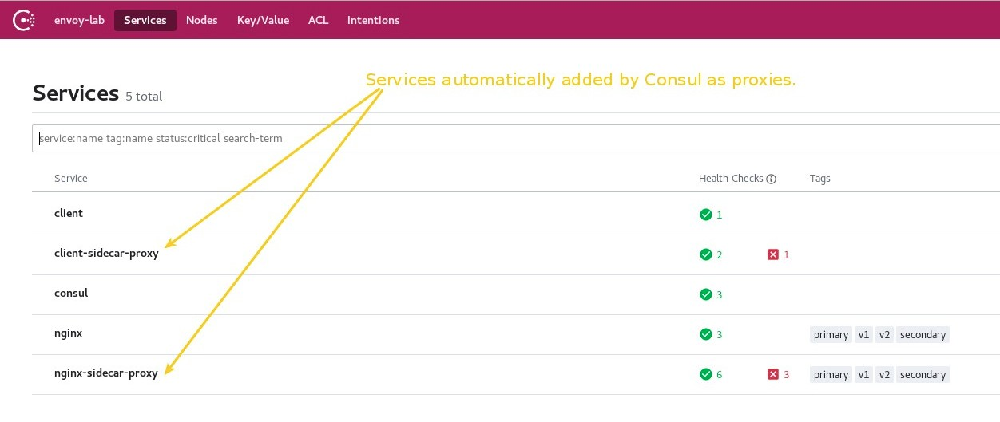

# Lab2: Integrating Envoy and Consul

In this lab you will run:

* A _[Consul](https://www.consul.io/)_ cluster with two registered services: a) _nginx_, b) _client_.
* An _[Envoy](https://www.envoyproxy.io/)_ proxy for the _nginx_ _[Consul](https://www.consul.io/)_ service.
* An _[Envoy](https://www.envoyproxy.io/)_ proxy for the _client_ _[Consul](https://www.consul.io/)_ service.

# Lab Goal

In this lab you'll practice how to configure _[Consul](https://www.consul.io/)_ to use _[Envoy](https://www.envoyproxy.io/)_ proxy in order to communicate two services. Usually _[Consul](https://www.consul.io/)_ can be used as a control plane in combination with its [Connect](https://www.consul.io/docs/connect/index.html) features.

Also you'll see how _[Consul Connect](https://www.consul.io/)_ is used to generate a boostrap configuration for _[Envoy](https://www.envoyproxy.io/)_.

After this lab you will have a better understanding on how _[Envoy](https://www.envoyproxy.io/)_ data plane is configured and how _[Consul](https://www.consul.io/)_ may be used as its control plane.

# Requirements

You will need to prepare configuration files for each node to run _Consul_ and _Envoy_.
To do this you may use the configuration files provided in this lab.

Please keep in mind that even it's possible to prepare all of this stuff automatically, the main goal of this lab is getting used to configure and run these tools. This will help you to have a better understanding of what's happening under the hoods.

# Preliminar explanations

_[Envoy](https://www.envoyproxy.io/)_ allows dynamic configuration using its xDS configuration API as explained in [this link](https://www.envoyproxy.io/docs/envoy/latest/intro/arch_overview/operations/dynamic_configuration).

_[Consul](https://www.consul.io/)_ and _[Envoy](https://www.envoyproxy.io/)_ talk to each other using [gRPC](https://grpc.io/). Specifically _[Consul](https://www.consul.io/)_ uses the _Aggregated xDS (a.k.a. ADS)_. This is a core key to understand how these softwares integrate each other.

# Configuring Consul

To configure _[Consul](https://www.consul.io/)_ you should _SSH_ into the nodes and modify a few files.

Once you login into one node you will find:

* The contents of this repository in the */home/vagrant/configuration_for_labs*.
* Configuration for _[Consul](https://www.consul.io/)_ at */home/vagrant/configuration_for_labs/lab2_integrating_consul_and_envoy/consul/config*.
* _[Consul](https://www.consul.io/)_ binary located at */opt/consul/bin/consul*.

Go to the  *[/home/vagrant/configuration_for_labs/lab2_integrating_consul_and_envoy/consul/config/main.hcl](./consul/config/main.hcl)* file and change the following directives:

* _bind_addr_: you need to set the IP address to the one assigned to the node. For example, for node-3 it should be 172.28.128.3.
* _addresses->http_: you need to set the IP address to the one assigned to the node. For example, for node-3 it should be 172.28.128.3.
* *node_name*: you should use a value _"node3"_ for node-3.
* *start_join*: update it with all nodes IP addresses. You only need to update these values if you changed the number of nodes in the _Vagrantfile_.
* *retry_join*: update it with all nodes IP addresses. You only need to update these values if you changed the number of nodes in the _Vagrantfile_.

Using the default values you should have a configuration like this for each node.

## main.hcl configuration for **node-3**

```bash
[vagrant@localhost ~]$ cat /opt/consul/config/main.hcl 
datacenter = "envoy-lab"
server = true
bind_addr = "172.28.128.3"
ports {
  grpc = 8502
}
addresses {
  http = "172.28.128.3"
}
data_dir = "/opt/consul/lib"
log_file = "/opt/consul/logsconsul.log"
node_name = "node3"
bootstrap_expect = 3
start_join = ["172.28.128.3","172.28.128.4","172.28.128.5"]
retry_join = ["172.28.128.3","172.28.128.4","172.28.128.5"]
connect {
  enabled = true
}
```

## main.hcl configuration for **node-4**

```bash
[vagrant@localhost ~]$ cat /opt/consul/config/main.hcl 
datacenter = "envoy-lab"
server = true
bind_addr = "172.28.128.4"
ports {
  grpc = 8502
}
addresses {
  http = "172.28.128.4"
}
data_dir = "/opt/consul/lib"
log_file = "/opt/consul/logs/consul.log"
node_name = "node4"
bootstrap_expect = 3
start_join = ["172.28.128.3","172.28.128.4","172.28.128.5"]
retry_join = ["172.28.128.3","172.28.128.4","172.28.128.5"]
connect {
  enabled = true
}
```

## main.hcl configuration for **node-5**

```bash
[vagrant@localhost ~]$ cat /opt/consul/config/main.hcl 
datacenter = "envoy-lab"
server = true
bind_addr = "172.28.128.5"
ports {
  grpc = 8502
}
addresses {
  http = "172.28.128.5"
}
data_dir = "/opt/consul/lib"
log_file = "/opt/consul/logs/consul.log"
node_name = "node5"
bootstrap_expect = 3
start_join = ["172.28.128.3","172.28.128.4","172.28.128.5"]
retry_join = ["172.28.128.3","172.28.128.4","172.28.128.5"]
connect {
  enabled = true
}
```

Now you may copy this configurations into the right folder which should be */opt/consul/config*. Use the commands below in each node:

```bash
# Copy the configurations files to Consul folder.
[vagrant@localhost config]$ cp -r /home/vagrant/lab2_integrating_consul_and_envoy/consul/config/* /opt/consul/config/

# Verify that the files have been copied.
[vagrant@localhost ~]$ ls /opt/consul/config/
main.hcl  services
```

# Running Consul

Now that you have configured _[Consul](https://www.consul.io/)_ you may start the cluster.
Please note that running the commands below will execute _[Consul](https://www.consul.io/)_ in foreground. Meaning that the shell will be blocked by the _[Consul](https://www.consul.io/)_ process. You may run it in background if you feel comfortable enough.

## Run Consul in node-3

```bash
[vagrant@localhost ~]$ /opt/consul/bin/consul agent -ui -config-file /opt/consul/config/main.hcl -config-dir /opt/consul/config/services/
bootstrap_expect > 0: expecting 3 servers
==> Starting Consul agent...
           Version: 'v1.7.2'
           Node ID: '67aae0e2-3545-4641-ea61-21696bda8704'
         Node name: 'node3'
        Datacenter: 'envoy-lab' (Segment: '<all>')
            Server: true (Bootstrap: false)
       Client Addr: [127.0.0.1] (HTTP: 8500, HTTPS: -1, gRPC: 8502, DNS: 8600)
      Cluster Addr: 172.28.128.3 (LAN: 8301, WAN: 8302)
           Encrypt: Gossip: false, TLS-Outgoing: false, TLS-Incoming: false, Auto-Encrypt-TLS: false

==> Log data will now stream in as it occurs:

    2020-04-10T19:18:02.695Z [INFO]  agent.server.raft: initial configuration: index=0 servers=[]
    2020-04-10T19:18:02.697Z [INFO]  agent.server.serf.wan: serf: EventMemberJoin: node3.envoy-lab 172.28.128.3
    2020-04-10T19:18:02.698Z [INFO]  agent.server.serf.lan: serf: EventMemberJoin: node3 172.28.128.3
    2020-04-10T19:18:02.702Z [INFO]  agent.server.raft: entering follower state: follower="Node at 172.28.128.3:8300 [Follower]" leader=
    2020-04-10T19:18:02.702Z [INFO]  agent.server: Adding LAN server: server="node3 (Addr: tcp/172.28.128.3:8300) (DC: envoy-lab)"
    2020-04-10T19:18:02.703Z [INFO]  agent.server: Handled event for server in area: event=member-join server=node3.envoy-lab area=wan
    2020-04-10T19:18:02.703Z [INFO]  agent: Started DNS server: address=127.0.0.1:8600 network=tcp
    2020-04-10T19:18:02.703Z [INFO]  agent: Started DNS server: address=127.0.0.1:8600 network=udp
    2020-04-10T19:18:02.704Z [INFO]  agent: Started HTTP server: address=172.28.128.3:8500 network=tcp
    2020-04-10T19:18:02.705Z [INFO]  agent: Started gRPC server: address=127.0.0.1:8502 network=tcp
    2020-04-10T19:18:02.705Z [INFO]  agent: Retry join is supported for the following discovery methods: cluster=LAN discovery_methods="aliyun aws azure digitalocean gce k8s linode mdns os packet scaleway softlayer tencentcloud triton vsphere"
    2020-04-10T19:18:02.705Z [INFO]  agent: Joining cluster...: cluster=LAN
    2020-04-10T19:18:02.705Z [INFO]  agent: (LAN) joining: lan_addresses=[172.28.128.3, 172.28.128.4, 172.28.128.5]
==> Joining cluster...
    2020-04-10T19:18:02.705Z [INFO]  agent: (LAN) joining: lan_addresses=[172.28.128.3, 172.28.128.4, 172.28.128.5]
    2020-04-10T19:18:02.707Z [INFO]  agent.server.serf.lan: serf: EventMemberJoin: node4 172.28.128.4
    2020-04-10T19:18:02.707Z [INFO]  agent.server.serf.lan: serf: EventMemberJoin: node5 172.28.128.5
    2020-04-10T19:18:02.708Z [INFO]  agent.server: Adding LAN server: server="node4 (Addr: tcp/172.28.128.4:8300) (DC: envoy-lab)"
    2020-04-10T19:18:02.711Z [INFO]  agent: (LAN) joined: number_of_nodes=3
    2020-04-10T19:18:02.711Z [INFO]  agent: Join cluster completed. Synced with initial agents: cluster=LAN num_agents=3
    2020-04-10T19:18:02.724Z [INFO]  agent: (LAN) joined: number_of_nodes=3
    2020-04-10T19:18:02.724Z [INFO]  agent: Join completed. Initial agents synced with: agent_count=3
    2020-04-10T19:18:02.724Z [INFO]  agent: started state syncer
==> Consul agent running!
    2020-04-10T19:18:02.727Z [INFO]  agent.server.serf.wan: serf: EventMemberJoin: node5.envoy-lab 172.28.128.5
    2020-04-10T19:18:02.727Z [INFO]  agent.server.serf.wan: serf: EventMemberJoin: node4.envoy-lab 172.28.128.4
    .
    .
    .
    2020-04-10T19:18:07.864Z [INFO]  agent.server: New leader elected: payload=node4
``` 

## Running Consul in node-4

```bash
[vagrant@localhost ~]$ /opt/consul/bin/consul agent -ui -config-file /opt/consul/config/main.hcl -config-dir /opt/consul/config/services/
bootstrap_expect > 0: expecting 3 servers
==> Starting Consul agent...
           Version: 'v1.7.2'
           Node ID: 'b7d8e683-150f-6c6c-3ea3-d7dc4e502822'
         Node name: 'node4'
        Datacenter: 'envoy-lab' (Segment: '<all>')
            Server: true (Bootstrap: false)
       Client Addr: [127.0.0.1] (HTTP: 8500, HTTPS: -1, gRPC: 8502, DNS: 8600)
      Cluster Addr: 172.28.128.4 (LAN: 8301, WAN: 8302)
           Encrypt: Gossip: false, TLS-Outgoing: false, TLS-Incoming: false, Auto-Encrypt-TLS: false

==> Log data will now stream in as it occurs:

    2020-04-10T19:16:47.059Z [INFO]  agent.server.raft: initial configuration: index=0 servers=[]
    2020-04-10T19:16:47.061Z [INFO]  agent.server.serf.wan: serf: EventMemberJoin: node4.envoy-lab 172.28.128.4
    2020-04-10T19:16:47.062Z [INFO]  agent.server.serf.lan: serf: EventMemberJoin: node4 172.28.128.4
    2020-04-10T19:16:47.063Z [INFO]  agent: Started DNS server: address=127.0.0.1:8600 network=udp
    2020-04-10T19:16:47.063Z [INFO]  agent.server.raft: entering follower state: follower="Node at 172.28.128.4:8300 [Follower]" leader=
    2020-04-10T19:16:47.063Z [INFO]  agent.server: Adding LAN server: server="node4 (Addr: tcp/172.28.128.4:8300) (DC: envoy-lab)"
    2020-04-10T19:16:47.063Z [INFO]  agent.server: Handled event for server in area: event=member-join server=node4.envoy-lab area=wan
    2020-04-10T19:16:47.064Z [INFO]  agent: Started DNS server: address=127.0.0.1:8600 network=tcp
    2020-04-10T19:16:47.064Z [INFO]  agent: Started HTTP server: address=172.28.128.4:8500 network=tcp
==> Joining cluster...
    2020-04-10T19:16:47.066Z [INFO]  agent: (LAN) joining: lan_addresses=[172.28.128.3, 172.28.128.4, 172.28.128.5]
    2020-04-10T19:16:47.067Z [INFO]  agent: Started gRPC server: address=127.0.0.1:8502 network=tcp
    2020-04-10T19:16:47.067Z [INFO]  agent: Retry join is supported for the following discovery methods: cluster=LAN discovery_methods="aliyun aws azure digitalocean gce k8s linode mdns os packet scaleway softlayer tencentcloud triton vsphere"
    2020-04-10T19:16:47.067Z [INFO]  agent: Joining cluster...: cluster=LAN
    2020-04-10T19:16:47.067Z [INFO]  agent: (LAN) joining: lan_addresses=[172.28.128.3, 172.28.128.4, 172.28.128.5]
    2020-04-10T19:16:47.070Z [INFO]  agent.server.serf.lan: serf: EventMemberJoin: node5 172.28.128.5
    2020-04-10T19:16:47.071Z [INFO]  agent: (LAN) joined: number_of_nodes=2
    2020-04-10T19:16:47.071Z [INFO]  agent: Join completed. Initial agents synced with: agent_count=2
```

# Running Consul in node-5

```bash
[vagrant@localhost ~]$ /opt/consul/bin/consul agent -ui -config-file /opt/consul/config/main.hcl -config-dir /opt/consul/config/services/
bootstrap_expect > 0: expecting 3 servers
==> Starting Consul agent...
           Version: 'v1.7.2'
           Node ID: '967ec96f-be8d-2d82-d2c6-233d3a1d506e'
         Node name: 'node5'
        Datacenter: 'envoy-lab' (Segment: '<all>')
            Server: true (Bootstrap: false)
       Client Addr: [127.0.0.1] (HTTP: 8500, HTTPS: -1, gRPC: 8502, DNS: 8600)
      Cluster Addr: 172.28.128.5 (LAN: 8301, WAN: 8302)
           Encrypt: Gossip: false, TLS-Outgoing: false, TLS-Incoming: false, Auto-Encrypt-TLS: false

==> Log data will now stream in as it occurs:

    2020-04-10T19:16:41.457Z [INFO]  agent.server.raft: initial configuration: index=0 servers=[]
    2020-04-10T19:16:41.458Z [INFO]  agent.server.serf.wan: serf: EventMemberJoin: node5.envoy-lab 172.28.128.5
    2020-04-10T19:16:41.459Z [INFO]  agent.server.serf.lan: serf: EventMemberJoin: node5 172.28.128.5
    2020-04-10T19:16:41.459Z [INFO]  agent: Started DNS server: address=127.0.0.1:8600 network=udp
    2020-04-10T19:16:41.460Z [INFO]  agent.server.raft: entering follower state: follower="Node at 172.28.128.5:8300 [Follower]" leader=
    2020-04-10T19:16:41.460Z [INFO]  agent.server: Adding LAN server: server="node5 (Addr: tcp/172.28.128.5:8300) (DC: envoy-lab)"
    2020-04-10T19:16:41.460Z [INFO]  agent.server: Handled event for server in area: event=member-join server=node5.envoy-lab area=wan
    2020-04-10T19:16:41.462Z [INFO]  agent: Started DNS server: address=127.0.0.1:8600 network=tcp
    2020-04-10T19:16:41.462Z [INFO]  agent: Started HTTP server: address=172.28.128.5:8500 network=tcp
==> Joining cluster...
    2020-04-10T19:16:41.463Z [INFO]  agent: (LAN) joining: lan_addresses=[172.28.128.3, 172.28.128.4, 172.28.128.5]
    2020-04-10T19:16:41.463Z [INFO]  agent: Started gRPC server: address=127.0.0.1:8502 network=tcp
    2020-04-10T19:16:41.463Z [INFO]  agent: Retry join is supported for the following discovery methods: cluster=LAN discovery_methods="aliyun aws azure digitalocean gce k8s linode mdns os packet scaleway softlayer tencentcloud triton vsphere"
    2020-04-10T19:16:41.463Z [INFO]  agent: Joining cluster...: cluster=LAN
    2020-04-10T19:16:41.463Z [INFO]  agent: (LAN) joining: lan_addresses=[172.28.128.3, 172.28.128.4, 172.28.128.5]
    2020-04-10T19:16:41.465Z [INFO]  agent: (LAN) joined: number_of_nodes=1
    2020-04-10T19:16:41.465Z [INFO]  agent: Join completed. Initial agents synced with: agent_count=1
    2020-04-10T19:16:41.465Z [INFO]  agent: started state syncer
==> Consul agent running!
    2020-04-10T19:16:41.467Z [INFO]  agent: (LAN) joined: number_of_nodes=1
```

Once you have _[Consul](https://www.consul.io/)_ up and running you may load the administration console. In this example is at [http://172.28.128.3:8500](http://172.28.128.3:8500).



You may see two services injected by _[Consul](https://www.consul.io/)_ automatically to use them as proxies.

# Configuring Envoy

* _[Envoy](https://www.envoyproxy.io/)_ configuration used for this examples. You will also learn how to generate this configuration yourself in this lab.

## Services registered

There are two services to register in the configuration files:

1. _nginx:_ which is the service that will serve HTTP requests.
2. _client:_ which is used to proxy all the HTTP request to the _nginx_ servers.

# Caveats

## Consul uses an Envoy instance per sidecar-proxy

Each service registered using _Connect-proxy_ will need a unique _Envoy_ instance. This is quite useful in a container ecosystem, but it's quite painful to configure in VM ecosystems.
The reason is that usually in VM ecosystems _Envoy_ is used as a proxy for all the services in the machine.

Take a look to this thread for a better undertanding on why is designed this way: [https://github.com/hashicorp/consul/issues/5388](https://github.com/hashicorp/consul/issues/5388)

## Running multiple Envoy instances

In order to run multiple _Envoy_ instances you will need to use the *--bind-id* parameter.
Also, if you are running multiple _Envoy_ instances, you'll need to change the _admin_ port.

```
envoy -c /tmp/envoy_config.json --base-id 1
```
