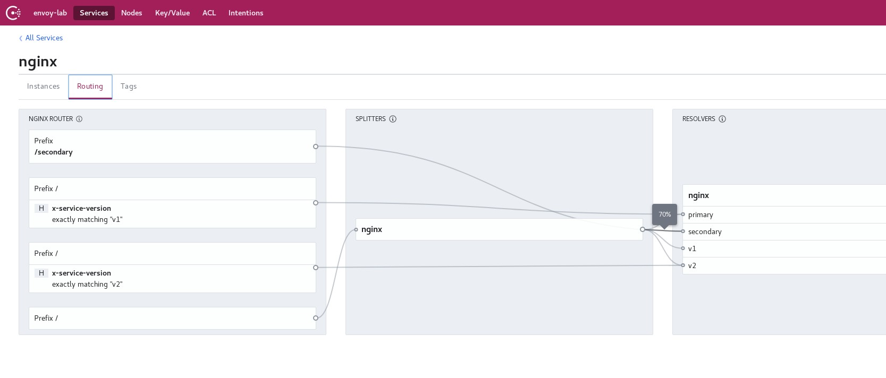

# Lab3: Consul traffic balancing with Envoy

In this lab you will:

* Use _[Consul](https://www.consul.io/)_ traffic management along with _[Envoy](https://www.envoyproxy.io/)_ to balance traffinc between different service versions.

# Lab Goal

At the end of this lab you should have a better understanding on _[Consul](https://www.consul.io/)_ features to manage traffic between services.
This will allow you to implement _blue-green_ or _canary_ deployments easily.

# Requirements

* Understanding of labs 1 and 2.
* Vagrant set up running.
* Lab 2 done and with _[Consul](https://www.consul.io/)_ and _[Envoy](https://www.envoyproxy.io/)_ up and running using the configurations of _Lab2_.

# Preliminar explanations

## How consul manages traffic

The best place to understand how _[Consul](https://www.consul.io/)_ manages configuration is [the official documentation](https://www.consul.io/docs/connect/l7-traffic-management.html).

In short it uses some internal service configuration. This configuration is divided in layers:

1. *[service-defaults](https://www.consul.io/docs/agent/config-entries/service-defaults.html)*: where you may set some default values for any specific service.
2. *[service-router](https://www.consul.io/docs/agent/config-entries/service-router.html)*: it allows to manage L7 traffic.
3. *[service-splitter](https://www.consul.io/docs/agent/config-entries/service-splitter.html)*: where you'll do the magic of traffic control.
4. *[service-resolver](https://www.consul.io/docs/agent/config-entries/service-resolver.html)*: it allows you to configure different subsets of service instances that should receive traffic.

# Configuring Consul

## Services configured in this lab

You will configure two services using _[Consul](https://www.consul.io/)_ configuration files:

* _nginx_ service: to register the _[Nginx](https://www.nginx.com/)_ web server.
* _client_ service: to register a fake service used to connect to the _nginx_ service.

And also, these configurations will register their proxies automatically as:

* _nginx-sidecar-proxy_: this service represents the _[Nginx](https://www.nginx.com/)_ sidecar proxy configured in _[Envoy](https://www.envoyproxy.io/)_.
* _client-sidecar-proxy_: this services represents the _client_ sidecar proxy configured in _[Envoy](https://www.envoyproxy.io/)_

These proxy services are generated automatically by _[Consul](https://www.consul.io/)_ when you configure [Consul Connect](https://www.consul.io/docs/connect/index.html).

## Configuring Nginx defaults

You need to set the service defaults to be able to split the traffic between different versions. The reason is that [Consul Connect](https://www.consul.io/docs/connect/index.html) does not support splitting traffic on TCP raw traffic yet.

```bash
# The command below doesn't have output if it works properly.
[vagrant@localhost traffic]$ /opt/consul/bin/consul config write -http-addr=http://172.28.128.3:8500 nginx_defaults.hcl

# Now let's see the defaults we just set. You should see the protocol set to http.
[vagrant@localhost traffic]$ /opt/consul/bin/consul config read -kind service-defaults -name nginx -http-addr=http://172.28.128.3:8500
{
    "Kind": "service-defaults",
    "Name": "nginx",
    "Protocol": "http",
    "MeshGateway": {},
    "Expose": {},
    "CreateIndex": 474,
    "ModifyIndex": 579
}
```

## Configuring Nginx resolver

The resolver is the piece that let us build subsets of a service.

```bash
# Just as before, if this commands ends succesfully it will not return any data.
[vagrant@localhost traffic]$ /opt/consul/bin/consul config write -http-addr=http://172.28.128.3:8500 nginx_resolver.hcl

# Now let's take a look to the resolver configuration
[vagrant@localhost traffic]$ /opt/consul/bin/consul config read -kind service-resolver -name nginx -http-addr=http://172.28.128.3:8500
{
    "Kind": "service-resolver",
    "Name": "nginx",
    "DefaultSubset": "primary",
    "Subsets": {
        "primary": {
            "Filter": "Service.Tags contains primary"
        },
        "secondary": {
            "Filter": "(Service.Tags contains v1) and (Service.Tags contains secondary)"
        },
        "v1": {
            "Filter": "Service.Tags contains v1"
        },
        "v2": {
            "Filter": "Service.Tags contains v2"
        }
    },
    "CreateIndex": 365,
    "ModifyIndex": 597
}
```

## Configuring Nginx splitter

Splitters use the previous resolvers defined in order to split the traffic among services.

```bash
# This command won't give any ouput if succesful.
[vagrant@localhost traffic]$ /opt/consul/bin/consul config write -http-addr=http://172.28.128.3:8500 nginx_splitter.hcl

# Let's take a look to the configured splitter.
[vagrant@localhost traffic]$ /opt/consul/bin/consul config read -kind service-splitter -name nginx -http-addr=http://172.28.128.3:8500
{
    "Kind": "service-splitter",
    "Name": "nginx",
    "Splits": [
        {
            "Weight": 10,
            "ServiceSubset": "v1"
        },
        {
            "Weight": 10,
            "ServiceSubset": "v2"
        },
        {
            "Weight": 10,
            "ServiceSubset": "primary"
        },
        {
            "Weight": 70,
            "ServiceSubset": "secondary"
        }
    ],
    "CreateIndex": 481,
    "ModifyIndex": 611
}
```

# Testing the deployment Services registered

## Ports used in this lab

First lets take a look to the ports used in this lab on. Node-3 is the one for this example:

* _8500:_ used to reach the _[Consul](https://www.consul.io/)_ UI and _[Consul](https://www.consul.io/)_ API.
* _80:_ Used by _[Nginx](https://www.nginx.com/)_ service.
* _8080:_ Used by _Client_ service. In fact we are not using this port at all.
* _21000:_ Used by _client-sidecar-proxy_ to open a listener with _[Envoy](https://www.envoyproxy.io/)_ as a downstream/upstream port for the _client_ service.
* _19191:_ Used by _client-sidecar-proxy_ to open a listener with _[Envoy](https://www.envoyproxy.io/)_ as an upstream from _client_ service to _nginx_ service.
* _21001:_ Used by _nginx-sidecar-proxy_ to open a listener with _[Envoy](https://www.envoyproxy.io/)_ as a downstream/upstream port for the _nginx_ service.

## Sending requests

The last step of this lab about testing that we really configured the proxies properly.

You may login into _node-3_ and use curl to send HTTP request to the _nginx_ service. Use the _19191_ opened by the _client-sidecar-proxy_ to make the query and you'll see something like below.

```bash
[vagrant@localhost traffic_management]$ curl localhost:19191
no healthy upstream
[vagrant@localhost traffic_management]$ curl localhost:19191
no healthy upstream
[vagrant@localhost traffic_management]$ curl localhost:19191
```

This error means that you are either landing on an unhealty enpoint or the _service-resolver_ isn't able to resolve a service using its filters.
If you take a look to the [_/opt/consul/config/services/nginx.hcl_](../lab2_integrating_consul_and_envoy/config/consul/services/nginx.hcl) of each node, you'll see that all of them are configured with the same _tags_: "primary" and "v1".
On the other hand, if you take a look to the [_service-resolver_ configuration](./consul/traffic_management/nginx_resolver.hcl), it tries to resolve some _nginx_ services using the following tags: "primary", "v1", "v2" and "secondary".
This leads to the _no healthy upstream_ error because the _service-resolver_ is willing to send most of the traffic to the _secondary_ subset.

### Fixing the errors

Now let's change the [_nginx_ service configuration file](../lab2_integrating_consul_and_envoy/config/consul/services/nginx.hcl) of nodes 4 and 5 to allow the _service-resolver_ do its job properly.
You'll need to set _nginx_ service tags to include a "v2" and "secondary" tags to match the _service-resolver_ filter rules. Below you have the example content.

```bash
# Changes for /opt/consul/config/services/nginx.hcl in node-4
[vagrant@localhost ~]$ cat /opt/consul/config/services/nginx.hcl 
Service {
  Name = "nginx"
  Tags = ["primary","v2"]
  Port = 80
  Meta {
    nginx = "1.0"
  }
  connect {
    sidecar_service {
    }
  }
}

# Changes for /opt/consul/config/services/nginx.hcl in node-5
[vagrant@localhost ~]$ cat /opt/consul/config/services/nginx.hcl 
Service {
  Name = "nginx"
  Tags = ["secondary","v1"]
  Port = 80
  Meta {
    nginx = "1.0"
  }
  connect {
    sidecar_service {
    }
  }
}
```

Now lets reload consul in nodes 4 and 5

```bash
# From node-4
[vagrant@localhost ~]$ /opt/consul/bin/consul reload -http-addr=172.28.128.4:8500
Configuration reload triggered

# From node-5
[vagrant@localhost ~]$ /opt/consul/bin/consul reload -http-addr=172.28.128.5:8500
Configuration reload triggered
```

You may now refresh the _Consul UI_ and take a look to the services tags.

## Testing again

```bash
Last login: Sat Apr 11 11:25:27 2020 from 10.0.2.2
[vagrant@localhost ~]$ curl localhost:19191
Hello from node 3
[vagrant@localhost ~]$ curl localhost:19191
Hello from node 3
```

It's important to use the proxy port listening on port _19191_ because _[Consul](https://www.consul.io/)_ configures _[Envoy](https://www.envoyproxy.io/)_ to use mTLS between services. This means that you won't be able to make this _curl_ call directly to the _[Envoy](https://www.envoyproxy.io/)_ proxy port _21001_ opened by the _nginx-sidecar-proxy_.

You will notice that most requests end up landing in node 5. You may play around with the weights defined in the *nginx_splitter.hcl* file and see what happens.

# Extra configuration - Consul service-router

_[Consul](https://www.consul.io/)_ service-routers allow you to manage _Layer 7_ traffic easily.

In this example you may use the *nginx_router.hcl* configuration file to set a few routes based on:

* *path_prefix*: this is the URL path. Also the example rewrites the path before sending it to the _upstream_.
* *headers*: this example sets the _x-service-version_ HTTP header to send traffic to the subsets defined in the _service-resolver.hcl_.

Below you'll find the configuration commands:

```bash
# Note that this command does not provide output if successful.
[vagrant@localhost traffic]$ /opt/consul/bin/consul config write -http-addr=http://172.28.128.3:8500 nginx_router.hcl

# Now let's take a look to the configuration set.
[vagrant@localhost traffic]$ /opt/consul/bin/consul config read -kind service-router -name nginx -http-addr=http://172.28.128.3:8500                  
{
    "Kind": "service-router",
    "Name": "nginx",
    "Routes": [
        {
            "Match": {
                "HTTP": {
                    "PathPrefix": "/secondary"
                }
            },
            "Destination": {
                "ServiceSubset": "secondary",
                "PrefixRewrite": "/"
            }
        },
        {
            "Match": {
                "HTTP": {
                    "Header": [
                        {
                            "Name": "x-service-version",
                            "Exact": "v1"
                        }
                    ]
                }
            },
            "Destination": {
                "ServiceSubset": "primary"
            }
        },
        {
            "Match": {
                "HTTP": {
                    "Header": [
                        {
                            "Name": "x-service-version",
                            "Exact": "v2"
                        }
                    ]
                }
            },
            "Destination": {
                "ServiceSubset": "v2"
            }
        }
    ],
    "CreateIndex": 178,
    "ModifyIndex": 297
}
```

Once you have the routes, you should see something like this in the _[Consul](https://www.consul.io/)_ UI for the _nginx_ service.



# What's happening under the hood

Well, you might be wondering how does _[Consul](https://www.consul.io/)_ all this magic.

In fact _[Consul](https://www.consul.io/)_ configures _[Envoy](https://www.envoyproxy.io/)_ adding:

* A new _cluster_ configuration for each entry in the *nginx_splitter.hcl* file.
* One _HTTP_ filter called _envoy.router_ to the _client_ configuration that has the upstreams configured.
* Some *dynamic_route_configs* to balance the traffic between the added _clusters_.

Below you have the complete _[Envoy](https://www.envoyproxy.io/)_ configuration of this example (it's quite long):

```bash
[vagrant@localhost traffic]$ curl http://172.28.128.3:29000/config_dump
{
 "configs": [
  {
   "@type": "type.googleapis.com/envoy.admin.v3.BootstrapConfigDump",
   "bootstrap": {
    "node": {
     "id": "client-sidecar-proxy",
     "cluster": "client",
     "metadata": {
      "namespace": "default",
      "envoy_version": "1.13.0"
     },
     "hidden_envoy_deprecated_build_version": "33197389c9b969f974be85a690113f1b955ad3d7/1.14.0-dev/clean-getenvoy-bd0b7e5-envoy/RELEASE/BoringSSL",
     "user_agent_name": "envoy",
     "user_agent_build_version": {
      "version": {
       "major_number": 1,
       "minor_number": 14
      },
      "metadata": {
       "ssl.version": "BoringSSL",
       "revision.status": "clean-getenvoy-bd0b7e5-envoy",
       "revision.sha": "33197389c9b969f974be85a690113f1b955ad3d7",
       "build.label": "dev",
       "build.type": "RELEASE"
      }
     },
     "extensions": [
      {
       "name": "default",
       "category": "envoy.dubbo_proxy.route_matchers"
      },
      {
       "name": "envoy.transport_sockets.alts",
       "category": "envoy.transport_sockets.upstream"
      },
      {
       "name": "envoy.transport_sockets.raw_buffer",
       "category": "envoy.transport_sockets.upstream"
      },
      {
       "name": "envoy.transport_sockets.tap",
       "category": "envoy.transport_sockets.upstream"
      },
      {
       "name": "envoy.transport_sockets.tls",
       "category": "envoy.transport_sockets.upstream"
      },
      {
       "name": "raw_buffer",
       "category": "envoy.transport_sockets.upstream"
      },
      {
       "name": "tls",
       "category": "envoy.transport_sockets.upstream"
      },
      {
       "name": "raw_udp_listener",
       "category": "envoy.udp_listeners"
      },
      {
       "name": "envoy.access_loggers.file",
       "category": "envoy.access_loggers"
      },
      {
       "name": "envoy.access_loggers.http_grpc",
       "category": "envoy.access_loggers"
      },
      {
       "name": "envoy.access_loggers.tcp_grpc",
       "category": "envoy.access_loggers"
      },
      {
       "name": "envoy.file_access_log",
       "category": "envoy.access_loggers"
      },
      {
       "name": "envoy.http_grpc_access_log",
       "category": "envoy.access_loggers"
      },
      {
       "name": "envoy.tcp_grpc_access_log",
       "category": "envoy.access_loggers"
      },
      {
       "name": "dubbo",
       "category": "envoy.dubbo_proxy.protocols"
      },
      {
       "name": "envoy.transport_sockets.alts",
       "category": "envoy.transport_sockets.downstream"
      },
      {
       "name": "envoy.transport_sockets.raw_buffer",
       "category": "envoy.transport_sockets.downstream"
      },
      {
       "name": "envoy.transport_sockets.tap",
       "category": "envoy.transport_sockets.downstream"
      },
      {
       "name": "envoy.transport_sockets.tls",
       "category": "envoy.transport_sockets.downstream"
      },
      {
       "name": "raw_buffer",
       "category": "envoy.transport_sockets.downstream"
      },
      {
       "name": "tls",
       "category": "envoy.transport_sockets.downstream"
      },
      {
       "name": "envoy.dog_statsd",
       "category": "envoy.stats_sinks"
      },
      {
       "name": "envoy.metrics_service",
       "category": "envoy.stats_sinks"
      },
      {
       "name": "envoy.stat_sinks.dog_statsd",
       "category": "envoy.stats_sinks"
      },
      {
       "name": "envoy.stat_sinks.hystrix",
       "category": "envoy.stats_sinks"
      },
      {
       "name": "envoy.stat_sinks.metrics_service",
       "category": "envoy.stats_sinks"
      },
      {
       "name": "envoy.stat_sinks.statsd",
       "category": "envoy.stats_sinks"
      },
      {
       "name": "envoy.statsd",
       "category": "envoy.stats_sinks"
      },
      {
       "name": "envoy.grpc_credentials.aws_iam",
       "category": "envoy.grpc_credentials"
      },
      {
       "name": "envoy.grpc_credentials.default",
       "category": "envoy.grpc_credentials"
      },
      {
       "name": "envoy.grpc_credentials.file_based_metadata",
       "category": "envoy.grpc_credentials"
      },
      {
       "name": "envoy.filters.udp.dns_filter",
       "category": "envoy.filters.udp_listener"
      },
      {
       "name": "envoy.filters.udp_listener.udp_proxy",
       "category": "envoy.filters.udp_listener"
      },
      {
       "name": "envoy.cluster.eds",
       "category": "envoy.clusters"
      },
      {
       "name": "envoy.cluster.logical_dns",
       "category": "envoy.clusters"
      },
      {
       "name": "envoy.cluster.original_dst",
       "category": "envoy.clusters"
      },
      {
       "name": "envoy.cluster.static",
       "category": "envoy.clusters"
      },
      {
       "name": "envoy.cluster.strict_dns",
       "category": "envoy.clusters"
      },
      {
       "name": "envoy.clusters.aggregate",
       "category": "envoy.clusters"
      },
      {
       "name": "envoy.clusters.dynamic_forward_proxy",
       "category": "envoy.clusters"
      },
      {
       "name": "envoy.clusters.redis",
       "category": "envoy.clusters"
      },
      {
       "name": "envoy.health_checkers.redis",
       "category": "envoy.health_checkers"
      },
      {
       "name": "envoy.filters.listener.http_inspector",
       "category": "envoy.filters.listener"
      },
      {
       "name": "envoy.filters.listener.original_dst",
       "category": "envoy.filters.listener"
      },
      {
       "name": "envoy.filters.listener.original_src",
       "category": "envoy.filters.listener"
      },
      {
       "name": "envoy.filters.listener.proxy_protocol",
       "category": "envoy.filters.listener"
      },
      {
       "name": "envoy.filters.listener.tls_inspector",
       "category": "envoy.filters.listener"
      },
      {
       "name": "envoy.listener.http_inspector",
       "category": "envoy.filters.listener"
      },
      {
       "name": "envoy.listener.original_dst",
       "category": "envoy.filters.listener"
      },
      {
       "name": "envoy.listener.original_src",
       "category": "envoy.filters.listener"
      },
      {
       "name": "envoy.listener.proxy_protocol",
       "category": "envoy.filters.listener"
      },
      {
       "name": "envoy.listener.tls_inspector",
       "category": "envoy.filters.listener"
      },
      {
       "name": "envoy.ip",
       "category": "envoy.resolvers"
      },
      {
       "name": "envoy.retry_host_predicates.omit_canary_hosts",
       "category": "envoy.retry_host_predicates"
      },
      {
       "name": "envoy.retry_host_predicates.omit_host_metadata",
       "category": "envoy.retry_host_predicates"
      },
      {
       "name": "envoy.retry_host_predicates.previous_hosts",
       "category": "envoy.retry_host_predicates"
      },
      {
       "name": "envoy.buffer",
       "category": "envoy.filters.http"
      },
      {
       "name": "envoy.cors",
       "category": "envoy.filters.http"
      },
      {
       "name": "envoy.csrf",
       "category": "envoy.filters.http"
      },
      {
       "name": "envoy.ext_authz",
       "category": "envoy.filters.http"
      },
      {
       "name": "envoy.fault",
       "category": "envoy.filters.http"
      },
      {
       "name": "envoy.filters.http.adaptive_concurrency",
       "category": "envoy.filters.http"
      },
      {
       "name": "envoy.filters.http.aws_lambda",
       "category": "envoy.filters.http"
      },
      {
       "name": "envoy.filters.http.aws_request_signing",
       "category": "envoy.filters.http"
      },
      {
       "name": "envoy.filters.http.buffer",
       "category": "envoy.filters.http"
      },
      {
       "name": "envoy.filters.http.cache",
       "category": "envoy.filters.http"
      },
      {
       "name": "envoy.filters.http.cors",
       "category": "envoy.filters.http"
      },
      {
       "name": "envoy.filters.http.csrf",
       "category": "envoy.filters.http"
      },
      {
       "name": "envoy.filters.http.dynamic_forward_proxy",
       "category": "envoy.filters.http"
      },
      {
       "name": "envoy.filters.http.dynamo",
       "category": "envoy.filters.http"
      },
      {
       "name": "envoy.filters.http.ext_authz",
       "category": "envoy.filters.http"
      },
      {
       "name": "envoy.filters.http.fault",
       "category": "envoy.filters.http"
      },
      {
       "name": "envoy.filters.http.grpc_http1_bridge",
       "category": "envoy.filters.http"
      },
      {
       "name": "envoy.filters.http.grpc_http1_reverse_bridge",
       "category": "envoy.filters.http"
      },
      {
       "name": "envoy.filters.http.grpc_json_transcoder",
       "category": "envoy.filters.http"
      },
      {
       "name": "envoy.filters.http.grpc_stats",
       "category": "envoy.filters.http"
      },
      {
       "name": "envoy.filters.http.grpc_web",
       "category": "envoy.filters.http"
      },
      {
       "name": "envoy.filters.http.gzip",
       "category": "envoy.filters.http"
      },
      {
       "name": "envoy.filters.http.header_to_metadata",
       "category": "envoy.filters.http"
      },
      {
       "name": "envoy.filters.http.health_check",
       "category": "envoy.filters.http"
      },
      {
       "name": "envoy.filters.http.ip_tagging",
       "category": "envoy.filters.http"
      },
      {
       "name": "envoy.filters.http.jwt_authn",
       "category": "envoy.filters.http"
      },
      {
       "name": "envoy.filters.http.lua",
       "category": "envoy.filters.http"
      },
      {
       "name": "envoy.filters.http.on_demand",
       "category": "envoy.filters.http"
      },
      {
       "name": "envoy.filters.http.original_src",
       "category": "envoy.filters.http"
      },
      {
       "name": "envoy.filters.http.ratelimit",
       "category": "envoy.filters.http"
      },
      {
       "name": "envoy.filters.http.rbac",
       "category": "envoy.filters.http"
      },
      {
       "name": "envoy.filters.http.router",
       "category": "envoy.filters.http"
      },
      {
       "name": "envoy.filters.http.squash",
       "category": "envoy.filters.http"
      },
      {
       "name": "envoy.filters.http.tap",
       "category": "envoy.filters.http"
      },
      {
       "name": "envoy.grpc_http1_bridge",
       "category": "envoy.filters.http"
      },
      {
       "name": "envoy.grpc_json_transcoder",
       "category": "envoy.filters.http"
      },
      {
       "name": "envoy.grpc_web",
       "category": "envoy.filters.http"
      },
      {
       "name": "envoy.gzip",
       "category": "envoy.filters.http"
      },
      {
       "name": "envoy.health_check",
       "category": "envoy.filters.http"
      },
      {
       "name": "envoy.http_dynamo_filter",
       "category": "envoy.filters.http"
      },
      {
       "name": "envoy.ip_tagging",
       "category": "envoy.filters.http"
      },
      {
       "name": "envoy.lua",
       "category": "envoy.filters.http"
      },
      {
       "name": "envoy.rate_limit",
       "category": "envoy.filters.http"
      },
      {
       "name": "envoy.router",
       "category": "envoy.filters.http"
      },
      {
       "name": "envoy.squash",
       "category": "envoy.filters.http"
      },
      {
       "name": "envoy.extensions.http.cache.simple",
       "category": "http_cache_factory"
      },
      {
       "name": "auto",
       "category": "envoy.thrift_proxy.protocols"
      },
      {
       "name": "binary",
       "category": "envoy.thrift_proxy.protocols"
      },
      {
       "name": "binary/non-strict",
       "category": "envoy.thrift_proxy.protocols"
      },
      {
       "name": "compact",
       "category": "envoy.thrift_proxy.protocols"
      },
      {
       "name": "twitter",
       "category": "envoy.thrift_proxy.protocols"
      },
      {
       "name": "envoy.client_ssl_auth",
       "category": "envoy.filters.network"
      },
      {
       "name": "envoy.echo",
       "category": "envoy.filters.network"
      },
      {
       "name": "envoy.ext_authz",
       "category": "envoy.filters.network"
      },
      {
       "name": "envoy.filters.network.client_ssl_auth",
       "category": "envoy.filters.network"
      },
      {
       "name": "envoy.filters.network.direct_response",
       "category": "envoy.filters.network"
      },
      {
       "name": "envoy.filters.network.dubbo_proxy",
       "category": "envoy.filters.network"
      },
      {
       "name": "envoy.filters.network.echo",
       "category": "envoy.filters.network"
      },
      {
       "name": "envoy.filters.network.ext_authz",
       "category": "envoy.filters.network"
      },
      {
       "name": "envoy.filters.network.http_connection_manager",
       "category": "envoy.filters.network"
      },
      {
       "name": "envoy.filters.network.kafka_broker",
       "category": "envoy.filters.network"
      },
      {
       "name": "envoy.filters.network.local_ratelimit",
       "category": "envoy.filters.network"
      },
      {
       "name": "envoy.filters.network.mongo_proxy",
       "category": "envoy.filters.network"
      },
      {
       "name": "envoy.filters.network.mysql_proxy",
       "category": "envoy.filters.network"
      },
      {
       "name": "envoy.filters.network.ratelimit",
       "category": "envoy.filters.network"
      },
      {
       "name": "envoy.filters.network.rbac",
       "category": "envoy.filters.network"
      },
      {
       "name": "envoy.filters.network.redis_proxy",
       "category": "envoy.filters.network"
      },
      {
       "name": "envoy.filters.network.sni_cluster",
       "category": "envoy.filters.network"
      },
      {
       "name": "envoy.filters.network.tcp_proxy",
       "category": "envoy.filters.network"
      },
      {
       "name": "envoy.filters.network.thrift_proxy",
       "category": "envoy.filters.network"
      },
      {
       "name": "envoy.filters.network.zookeeper_proxy",
       "category": "envoy.filters.network"
      },
      {
       "name": "envoy.http_connection_manager",
       "category": "envoy.filters.network"
      },
      {
       "name": "envoy.mongo_proxy",
       "category": "envoy.filters.network"
      },
      {
       "name": "envoy.ratelimit",
       "category": "envoy.filters.network"
      },
      {
       "name": "envoy.redis_proxy",
       "category": "envoy.filters.network"
      },
      {
       "name": "envoy.tcp_proxy",
       "category": "envoy.filters.network"
      },
      {
       "name": "auto",
       "category": "envoy.thrift_proxy.transports"
      },
      {
       "name": "framed",
       "category": "envoy.thrift_proxy.transports"
      },
      {
       "name": "header",
       "category": "envoy.thrift_proxy.transports"
      },
      {
       "name": "unframed",
       "category": "envoy.thrift_proxy.transports"
      },
      {
       "name": "envoy.filters.thrift.rate_limit",
       "category": "envoy.thrift_proxy.filters"
      },
      {
       "name": "envoy.filters.thrift.router",
       "category": "envoy.thrift_proxy.filters"
      },
      {
       "name": "envoy.resource_monitors.fixed_heap",
       "category": "envoy.resource_monitors"
      },
      {
       "name": "envoy.resource_monitors.injected_resource",
       "category": "envoy.resource_monitors"
      },
      {
       "name": "envoy.dynamic.ot",
       "category": "envoy.tracers"
      },
      {
       "name": "envoy.lightstep",
       "category": "envoy.tracers"
      },
      {
       "name": "envoy.tracers.datadog",
       "category": "envoy.tracers"
      },
      {
       "name": "envoy.tracers.dynamic_ot",
       "category": "envoy.tracers"
      },
      {
       "name": "envoy.tracers.lightstep",
       "category": "envoy.tracers"
      },
      {
       "name": "envoy.tracers.opencensus",
       "category": "envoy.tracers"
      },
      {
       "name": "envoy.tracers.xray",
       "category": "envoy.tracers"
      },
      {
       "name": "envoy.tracers.zipkin",
       "category": "envoy.tracers"
      },
      {
       "name": "envoy.zipkin",
       "category": "envoy.tracers"
      },
      {
       "name": "envoy.retry_priorities.previous_priorities",
       "category": "envoy.retry_priorities"
      },
      {
       "name": "dubbo.hessian2",
       "category": "envoy.dubbo_proxy.serializers"
      },
      {
       "name": "envoy.filters.dubbo.router",
       "category": "envoy.dubbo_proxy.filters"
      }
     ]
    },
    "static_resources": {
     "clusters": [
      {
       "name": "local_agent",
       "type": "STATIC",
       "connect_timeout": "1s",
       "hidden_envoy_deprecated_hosts": [
        {
         "socket_address": {
          "address": "127.0.0.1",
          "port_value": 8502
         }
        }
       ],
       "http2_protocol_options": {}
      }
     ]
    },
    "dynamic_resources": {
     "lds_config": {
      "ads": {}
     },
     "cds_config": {
      "ads": {}
     },
     "ads_config": {
      "api_type": "GRPC",
      "grpc_services": [
       {
        "envoy_grpc": {
         "cluster_name": "local_agent"
        },
        "initial_metadata": [
         {
          "key": "x-consul-token"
         }
        ]
       }
      ]
     }
    },
    "admin": {
     "access_log_path": "/dev/null",
     "address": {
      "socket_address": {
       "address": "172.28.128.3",
       "port_value": 29000
      }
     }
    },
    "stats_config": {
     "stats_tags": [
      {
       "tag_name": "consul.custom_hash",
       "regex": "^cluster\\.((?:([^.]+)~)?(?:[^.]+\\.)?[^.]+\\.[^.]+\\.[^.]+\\.[^.]+\\.[^.]+\\.consul\\.)"
      },
      {
       "tag_name": "consul.service_subset",
       "regex": "^cluster\\.((?:[^.]+~)?(?:([^.]+)\\.)?[^.]+\\.[^.]+\\.[^.]+\\.[^.]+\\.[^.]+\\.consul\\.)"
      },
      {
       "tag_name": "consul.service",
       "regex": "^cluster\\.((?:[^.]+~)?(?:[^.]+\\.)?([^.]+)\\.[^.]+\\.[^.]+\\.[^.]+\\.[^.]+\\.consul\\.)"
      },
      {
       "tag_name": "consul.namespace",
       "regex": "^cluster\\.((?:[^.]+~)?(?:[^.]+\\.)?[^.]+\\.([^.]+)\\.[^.]+\\.[^.]+\\.[^.]+\\.consul\\.)"
      },
      {
       "tag_name": "consul.datacenter",
       "regex": "^cluster\\.((?:[^.]+~)?(?:[^.]+\\.)?[^.]+\\.[^.]+\\.([^.]+)\\.[^.]+\\.[^.]+\\.consul\\.)"
      },
      {
       "tag_name": "consul.routing_type",
       "regex": "^cluster\\.((?:[^.]+~)?(?:[^.]+\\.)?[^.]+\\.[^.]+\\.[^.]+\\.([^.]+)\\.[^.]+\\.consul\\.)"
      },
      {
       "tag_name": "consul.trust_domain",
       "regex": "^cluster\\.((?:[^.]+~)?(?:[^.]+\\.)?[^.]+\\.[^.]+\\.[^.]+\\.[^.]+\\.([^.]+)\\.consul\\.)"
      },
      {
       "tag_name": "consul.target",
       "regex": "^cluster\\.(((?:[^.]+~)?(?:[^.]+\\.)?[^.]+\\.[^.]+\\.[^.]+)\\.[^.]+\\.[^.]+\\.consul\\.)"
      },
      {
       "tag_name": "consul.full_target",
       "regex": "^cluster\\.(((?:[^.]+~)?(?:[^.]+\\.)?[^.]+\\.[^.]+\\.[^.]+\\.[^.]+\\.[^.]+)\\.consul\\.)"
      },
      {
       "tag_name": "local_cluster",
       "fixed_value": "client"
      }
     ],
     "use_all_default_tags": true
    },
    "layered_runtime": {
     "layers": [
      {
       "name": "static_layer",
       "static_layer": {
        "envoy.deprecated_features:envoy.config.trace.v2.ZipkinConfig.HTTP_JSON_V1": true,
        "envoy.deprecated_features:envoy.config.filter.network.http_connection_manager.v2.HttpConnectionManager.Tracing.operation_name": true,
        "envoy.deprecated_features:envoy.api.v2.Cluster.tls_context": true
       }
      }
     ]
    }
   },
   "last_updated": "2020-04-12T18:22:02.352Z"
  },
  {
   "@type": "type.googleapis.com/envoy.admin.v3.ClustersConfigDump",
   "version_info": "00000001",
   "static_clusters": [
    {
     "cluster": {
      "@type": "type.googleapis.com/envoy.api.v2.Cluster",
      "name": "local_agent",
      "type": "STATIC",
      "connect_timeout": "1s",
      "hosts": [
       {
        "socket_address": {
         "address": "127.0.0.1",
         "port_value": 8502
        }
       }
      ],
      "http2_protocol_options": {}
     },
     "last_updated": "2020-04-12T18:22:02.366Z"
    }
   ],
   "dynamic_active_clusters": [
    {
     "version_info": "00000001",
     "cluster": {
      "@type": "type.googleapis.com/envoy.api.v2.Cluster",
      "name": "local_app",
      "type": "STATIC",
      "connect_timeout": "5s",
      "load_assignment": {
       "cluster_name": "local_app",
       "endpoints": [
        {
         "lb_endpoints": [
          {
           "endpoint": {
            "address": {
             "socket_address": {
              "address": "127.0.0.1",
              "port_value": 8080
             }
            }
           }
          }
         ]
        }
       ]
      }
     },
     "last_updated": "2020-04-12T18:22:02.387Z"
    },
    {
     "version_info": "00000001",
     "cluster": {
      "@type": "type.googleapis.com/envoy.api.v2.Cluster",
      "name": "primary.nginx.default.envoy-lab.internal.1db54f6f-9fa0-5c5d-5cfe-bc0b9e6dbd62.consul",
      "type": "EDS",
      "eds_cluster_config": {
       "eds_config": {
        "ads": {}
       }
      },
      "connect_timeout": "5s",
      "circuit_breakers": {},
      "tls_context": {
       "common_tls_context": {
        "tls_params": {},
        "tls_certificates": [
         {
          "certificate_chain": {
           "inline_string": "-----BEGIN CERTIFICATE-----\nMIICSTCCAe+gAwIBAgIBCjAKBggqhkjOPQQDAjAwMS4wLAYDVQQDEyVwcmktbHk3\naXEwbS5jb25zdWwuY2EuMWRiNTRmNmYuY29uc3VsMB4XDTIwMDQxMjE4MDUzN1oX\nDTIwMDQxNTE4MDUzN1owLTErMCkGA1UEAxMiY2xpZW50LnN2Yy5kZWZhdWx0LjFk\nYjU0ZjZmLmNvbnN1bDBZMBMGByqGSM49AgEGCCqGSM49AwEHA0IABMvzbDE7CXj7\n+DfyI9/WWPXNzYrTalKIVGz1+Ebql52sWe6gVpsQTEoxtM/88td4os1/IxnC7nG/\nW2lV+Lgn3d6jgfwwgfkwDgYDVR0PAQH/BAQDAgO4MB0GA1UdJQQWMBQGCCsGAQUF\nBwMCBggrBgEFBQcDATAMBgNVHRMBAf8EAjAAMCkGA1UdDgQiBCDoaeWonBuaDAHv\nMUJ1b2EB83boUURfpQ0/yVTdBlqtDDArBgNVHSMEJDAigCBfHndAYlFpB46JHbcU\nByOHUZEShYhvl+x/x2VR708e+DBiBgNVHREEWzBZhldzcGlmZmU6Ly8xZGI1NGY2\nZi05ZmEwLTVjNWQtNWNmZS1iYzBiOWU2ZGJkNjIuY29uc3VsL25zL2RlZmF1bHQv\nZGMvZW52b3ktbGFiL3N2Yy9jbGllbnQwCgYIKoZIzj0EAwIDSAAwRQIhALq0PokS\nRcjCSGWXVzAjTVPOB3J0wZqJk6HZe/Iyfm3PAiBlxJ5GJFm3emtVzUT+iM39rIET\nDoG/2Uz2st7NrAO8xw==\n-----END CERTIFICATE-----\n"
          },
          "private_key": {
           "inline_string": "[redacted]"
          }
         }
        ],
        "validation_context": {
         "trusted_ca": {
          "inline_string": "-----BEGIN CERTIFICATE-----\nMIICDTCCAbOgAwIBAgIBCDAKBggqhkjOPQQDAjAwMS4wLAYDVQQDEyVwcmktbHk3\naXEwbS5jb25zdWwuY2EuMWRiNTRmNmYuY29uc3VsMB4XDTIwMDQxMjE4MDYzNloX\nDTMwMDQxMjE4MDYzNlowMDEuMCwGA1UEAxMlcHJpLWx5N2lxMG0uY29uc3VsLmNh\nLjFkYjU0ZjZmLmNvbnN1bDBZMBMGByqGSM49AgEGCCqGSM49AwEHA0IABAAuUem3\nztCG2lzgB5DOvxDGfuSM+YJ1e3Hed3EWHE6PYlT7TXi9xgGTW2/yKacuYCR3zD8F\no39cqb2siIqYBs+jgb0wgbowDgYDVR0PAQH/BAQDAgGGMA8GA1UdEwEB/wQFMAMB\nAf8wKQYDVR0OBCIEIF8ed0BiUWkHjokdtxQHI4dRkRKFiG+X7H/HZVHvTx74MCsG\nA1UdIwQkMCKAIF8ed0BiUWkHjokdtxQHI4dRkRKFiG+X7H/HZVHvTx74MD8GA1Ud\nEQQ4MDaGNHNwaWZmZTovLzFkYjU0ZjZmLTlmYTAtNWM1ZC01Y2ZlLWJjMGI5ZTZk\nYmQ2Mi5jb25zdWwwCgYIKoZIzj0EAwIDSAAwRQIgBacTc/BgC+7CkzQWR36uxsQj\nHVxruXfaovikz6pCFegCIQCvufZqQK/mbzH3EZ/2brd63G/LICx+8a64Ge+C1MaM\nLQ==\n-----END CERTIFICATE-----\n"
         }
        }
       },
       "sni": "primary.nginx.default.envoy-lab.internal.1db54f6f-9fa0-5c5d-5cfe-bc0b9e6dbd62.consul"
      },
      "outlier_detection": {},
      "common_lb_config": {
       "healthy_panic_threshold": {}
      },
      "alt_stat_name": "primary.nginx.default.envoy-lab.internal.1db54f6f-9fa0-5c5d-5cfe-bc0b9e6dbd62.consul"
     },
     "last_updated": "2020-04-12T18:22:02.398Z"
    },
    {
     "version_info": "00000001",
     "cluster": {
      "@type": "type.googleapis.com/envoy.api.v2.Cluster",
      "name": "secondary.nginx.default.envoy-lab.internal.1db54f6f-9fa0-5c5d-5cfe-bc0b9e6dbd62.consul",
      "type": "EDS",
      "eds_cluster_config": {
       "eds_config": {
        "ads": {}
       }
      },
      "connect_timeout": "5s",
      "circuit_breakers": {},
      "tls_context": {
       "common_tls_context": {
        "tls_params": {},
        "tls_certificates": [
         {
          "certificate_chain": {
           "inline_string": "-----BEGIN CERTIFICATE-----\nMIICSTCCAe+gAwIBAgIBCjAKBggqhkjOPQQDAjAwMS4wLAYDVQQDEyVwcmktbHk3\naXEwbS5jb25zdWwuY2EuMWRiNTRmNmYuY29uc3VsMB4XDTIwMDQxMjE4MDUzN1oX\nDTIwMDQxNTE4MDUzN1owLTErMCkGA1UEAxMiY2xpZW50LnN2Yy5kZWZhdWx0LjFk\nYjU0ZjZmLmNvbnN1bDBZMBMGByqGSM49AgEGCCqGSM49AwEHA0IABMvzbDE7CXj7\n+DfyI9/WWPXNzYrTalKIVGz1+Ebql52sWe6gVpsQTEoxtM/88td4os1/IxnC7nG/\nW2lV+Lgn3d6jgfwwgfkwDgYDVR0PAQH/BAQDAgO4MB0GA1UdJQQWMBQGCCsGAQUF\nBwMCBggrBgEFBQcDATAMBgNVHRMBAf8EAjAAMCkGA1UdDgQiBCDoaeWonBuaDAHv\nMUJ1b2EB83boUURfpQ0/yVTdBlqtDDArBgNVHSMEJDAigCBfHndAYlFpB46JHbcU\nByOHUZEShYhvl+x/x2VR708e+DBiBgNVHREEWzBZhldzcGlmZmU6Ly8xZGI1NGY2\nZi05ZmEwLTVjNWQtNWNmZS1iYzBiOWU2ZGJkNjIuY29uc3VsL25zL2RlZmF1bHQv\nZGMvZW52b3ktbGFiL3N2Yy9jbGllbnQwCgYIKoZIzj0EAwIDSAAwRQIhALq0PokS\nRcjCSGWXVzAjTVPOB3J0wZqJk6HZe/Iyfm3PAiBlxJ5GJFm3emtVzUT+iM39rIET\nDoG/2Uz2st7NrAO8xw==\n-----END CERTIFICATE-----\n"
          },
          "private_key": {
           "inline_string": "[redacted]"
          }
         }
        ],
        "validation_context": {
         "trusted_ca": {
          "inline_string": "-----BEGIN CERTIFICATE-----\nMIICDTCCAbOgAwIBAgIBCDAKBggqhkjOPQQDAjAwMS4wLAYDVQQDEyVwcmktbHk3\naXEwbS5jb25zdWwuY2EuMWRiNTRmNmYuY29uc3VsMB4XDTIwMDQxMjE4MDYzNloX\nDTMwMDQxMjE4MDYzNlowMDEuMCwGA1UEAxMlcHJpLWx5N2lxMG0uY29uc3VsLmNh\nLjFkYjU0ZjZmLmNvbnN1bDBZMBMGByqGSM49AgEGCCqGSM49AwEHA0IABAAuUem3\nztCG2lzgB5DOvxDGfuSM+YJ1e3Hed3EWHE6PYlT7TXi9xgGTW2/yKacuYCR3zD8F\no39cqb2siIqYBs+jgb0wgbowDgYDVR0PAQH/BAQDAgGGMA8GA1UdEwEB/wQFMAMB\nAf8wKQYDVR0OBCIEIF8ed0BiUWkHjokdtxQHI4dRkRKFiG+X7H/HZVHvTx74MCsG\nA1UdIwQkMCKAIF8ed0BiUWkHjokdtxQHI4dRkRKFiG+X7H/HZVHvTx74MD8GA1Ud\nEQQ4MDaGNHNwaWZmZTovLzFkYjU0ZjZmLTlmYTAtNWM1ZC01Y2ZlLWJjMGI5ZTZk\nYmQ2Mi5jb25zdWwwCgYIKoZIzj0EAwIDSAAwRQIgBacTc/BgC+7CkzQWR36uxsQj\nHVxruXfaovikz6pCFegCIQCvufZqQK/mbzH3EZ/2brd63G/LICx+8a64Ge+C1MaM\nLQ==\n-----END CERTIFICATE-----\n"
         }
        }
       },
       "sni": "secondary.nginx.default.envoy-lab.internal.1db54f6f-9fa0-5c5d-5cfe-bc0b9e6dbd62.consul"
      },
      "outlier_detection": {},
      "common_lb_config": {
       "healthy_panic_threshold": {}
      },
      "alt_stat_name": "secondary.nginx.default.envoy-lab.internal.1db54f6f-9fa0-5c5d-5cfe-bc0b9e6dbd62.consul"
     },
     "last_updated": "2020-04-12T18:22:02.432Z"
    },
    {
     "version_info": "00000001",
     "cluster": {
      "@type": "type.googleapis.com/envoy.api.v2.Cluster",
      "name": "v1.nginx.default.envoy-lab.internal.1db54f6f-9fa0-5c5d-5cfe-bc0b9e6dbd62.consul",
      "type": "EDS",
      "eds_cluster_config": {
       "eds_config": {
        "ads": {}
       }
      },
      "connect_timeout": "5s",
      "circuit_breakers": {},
      "tls_context": {
       "common_tls_context": {
        "tls_params": {},
        "tls_certificates": [
         {
          "certificate_chain": {
           "inline_string": "-----BEGIN CERTIFICATE-----\nMIICSTCCAe+gAwIBAgIBCjAKBggqhkjOPQQDAjAwMS4wLAYDVQQDEyVwcmktbHk3\naXEwbS5jb25zdWwuY2EuMWRiNTRmNmYuY29uc3VsMB4XDTIwMDQxMjE4MDUzN1oX\nDTIwMDQxNTE4MDUzN1owLTErMCkGA1UEAxMiY2xpZW50LnN2Yy5kZWZhdWx0LjFk\nYjU0ZjZmLmNvbnN1bDBZMBMGByqGSM49AgEGCCqGSM49AwEHA0IABMvzbDE7CXj7\n+DfyI9/WWPXNzYrTalKIVGz1+Ebql52sWe6gVpsQTEoxtM/88td4os1/IxnC7nG/\nW2lV+Lgn3d6jgfwwgfkwDgYDVR0PAQH/BAQDAgO4MB0GA1UdJQQWMBQGCCsGAQUF\nBwMCBggrBgEFBQcDATAMBgNVHRMBAf8EAjAAMCkGA1UdDgQiBCDoaeWonBuaDAHv\nMUJ1b2EB83boUURfpQ0/yVTdBlqtDDArBgNVHSMEJDAigCBfHndAYlFpB46JHbcU\nByOHUZEShYhvl+x/x2VR708e+DBiBgNVHREEWzBZhldzcGlmZmU6Ly8xZGI1NGY2\nZi05ZmEwLTVjNWQtNWNmZS1iYzBiOWU2ZGJkNjIuY29uc3VsL25zL2RlZmF1bHQv\nZGMvZW52b3ktbGFiL3N2Yy9jbGllbnQwCgYIKoZIzj0EAwIDSAAwRQIhALq0PokS\nRcjCSGWXVzAjTVPOB3J0wZqJk6HZe/Iyfm3PAiBlxJ5GJFm3emtVzUT+iM39rIET\nDoG/2Uz2st7NrAO8xw==\n-----END CERTIFICATE-----\n"
          },
          "private_key": {
           "inline_string": "[redacted]"
          }
         }
        ],
        "validation_context": {
         "trusted_ca": {
          "inline_string": "-----BEGIN CERTIFICATE-----\nMIICDTCCAbOgAwIBAgIBCDAKBggqhkjOPQQDAjAwMS4wLAYDVQQDEyVwcmktbHk3\naXEwbS5jb25zdWwuY2EuMWRiNTRmNmYuY29uc3VsMB4XDTIwMDQxMjE4MDYzNloX\nDTMwMDQxMjE4MDYzNlowMDEuMCwGA1UEAxMlcHJpLWx5N2lxMG0uY29uc3VsLmNh\nLjFkYjU0ZjZmLmNvbnN1bDBZMBMGByqGSM49AgEGCCqGSM49AwEHA0IABAAuUem3\nztCG2lzgB5DOvxDGfuSM+YJ1e3Hed3EWHE6PYlT7TXi9xgGTW2/yKacuYCR3zD8F\no39cqb2siIqYBs+jgb0wgbowDgYDVR0PAQH/BAQDAgGGMA8GA1UdEwEB/wQFMAMB\nAf8wKQYDVR0OBCIEIF8ed0BiUWkHjokdtxQHI4dRkRKFiG+X7H/HZVHvTx74MCsG\nA1UdIwQkMCKAIF8ed0BiUWkHjokdtxQHI4dRkRKFiG+X7H/HZVHvTx74MD8GA1Ud\nEQQ4MDaGNHNwaWZmZTovLzFkYjU0ZjZmLTlmYTAtNWM1ZC01Y2ZlLWJjMGI5ZTZk\nYmQ2Mi5jb25zdWwwCgYIKoZIzj0EAwIDSAAwRQIgBacTc/BgC+7CkzQWR36uxsQj\nHVxruXfaovikz6pCFegCIQCvufZqQK/mbzH3EZ/2brd63G/LICx+8a64Ge+C1MaM\nLQ==\n-----END CERTIFICATE-----\n"
         }
        }
       },
       "sni": "v1.nginx.default.envoy-lab.internal.1db54f6f-9fa0-5c5d-5cfe-bc0b9e6dbd62.consul"
      },
      "outlier_detection": {},
      "common_lb_config": {
       "healthy_panic_threshold": {}
      },
      "alt_stat_name": "v1.nginx.default.envoy-lab.internal.1db54f6f-9fa0-5c5d-5cfe-bc0b9e6dbd62.consul"
     },
     "last_updated": "2020-04-12T18:22:02.421Z"
    },
    {
     "version_info": "00000001",
     "cluster": {
      "@type": "type.googleapis.com/envoy.api.v2.Cluster",
      "name": "v2.nginx.default.envoy-lab.internal.1db54f6f-9fa0-5c5d-5cfe-bc0b9e6dbd62.consul",
      "type": "EDS",
      "eds_cluster_config": {
       "eds_config": {
        "ads": {}
       }
      },
      "connect_timeout": "5s",
      "circuit_breakers": {},
      "tls_context": {
       "common_tls_context": {
        "tls_params": {},
        "tls_certificates": [
         {
          "certificate_chain": {
           "inline_string": "-----BEGIN CERTIFICATE-----\nMIICSTCCAe+gAwIBAgIBCjAKBggqhkjOPQQDAjAwMS4wLAYDVQQDEyVwcmktbHk3\naXEwbS5jb25zdWwuY2EuMWRiNTRmNmYuY29uc3VsMB4XDTIwMDQxMjE4MDUzN1oX\nDTIwMDQxNTE4MDUzN1owLTErMCkGA1UEAxMiY2xpZW50LnN2Yy5kZWZhdWx0LjFk\nYjU0ZjZmLmNvbnN1bDBZMBMGByqGSM49AgEGCCqGSM49AwEHA0IABMvzbDE7CXj7\n+DfyI9/WWPXNzYrTalKIVGz1+Ebql52sWe6gVpsQTEoxtM/88td4os1/IxnC7nG/\nW2lV+Lgn3d6jgfwwgfkwDgYDVR0PAQH/BAQDAgO4MB0GA1UdJQQWMBQGCCsGAQUF\nBwMCBggrBgEFBQcDATAMBgNVHRMBAf8EAjAAMCkGA1UdDgQiBCDoaeWonBuaDAHv\nMUJ1b2EB83boUURfpQ0/yVTdBlqtDDArBgNVHSMEJDAigCBfHndAYlFpB46JHbcU\nByOHUZEShYhvl+x/x2VR708e+DBiBgNVHREEWzBZhldzcGlmZmU6Ly8xZGI1NGY2\nZi05ZmEwLTVjNWQtNWNmZS1iYzBiOWU2ZGJkNjIuY29uc3VsL25zL2RlZmF1bHQv\nZGMvZW52b3ktbGFiL3N2Yy9jbGllbnQwCgYIKoZIzj0EAwIDSAAwRQIhALq0PokS\nRcjCSGWXVzAjTVPOB3J0wZqJk6HZe/Iyfm3PAiBlxJ5GJFm3emtVzUT+iM39rIET\nDoG/2Uz2st7NrAO8xw==\n-----END CERTIFICATE-----\n"
          },
          "private_key": {
           "inline_string": "[redacted]"
          }
         }
        ],
        "validation_context": {
         "trusted_ca": {
          "inline_string": "-----BEGIN CERTIFICATE-----\nMIICDTCCAbOgAwIBAgIBCDAKBggqhkjOPQQDAjAwMS4wLAYDVQQDEyVwcmktbHk3\naXEwbS5jb25zdWwuY2EuMWRiNTRmNmYuY29uc3VsMB4XDTIwMDQxMjE4MDYzNloX\nDTMwMDQxMjE4MDYzNlowMDEuMCwGA1UEAxMlcHJpLWx5N2lxMG0uY29uc3VsLmNh\nLjFkYjU0ZjZmLmNvbnN1bDBZMBMGByqGSM49AgEGCCqGSM49AwEHA0IABAAuUem3\nztCG2lzgB5DOvxDGfuSM+YJ1e3Hed3EWHE6PYlT7TXi9xgGTW2/yKacuYCR3zD8F\no39cqb2siIqYBs+jgb0wgbowDgYDVR0PAQH/BAQDAgGGMA8GA1UdEwEB/wQFMAMB\nAf8wKQYDVR0OBCIEIF8ed0BiUWkHjokdtxQHI4dRkRKFiG+X7H/HZVHvTx74MCsG\nA1UdIwQkMCKAIF8ed0BiUWkHjokdtxQHI4dRkRKFiG+X7H/HZVHvTx74MD8GA1Ud\nEQQ4MDaGNHNwaWZmZTovLzFkYjU0ZjZmLTlmYTAtNWM1ZC01Y2ZlLWJjMGI5ZTZk\nYmQ2Mi5jb25zdWwwCgYIKoZIzj0EAwIDSAAwRQIgBacTc/BgC+7CkzQWR36uxsQj\nHVxruXfaovikz6pCFegCIQCvufZqQK/mbzH3EZ/2brd63G/LICx+8a64Ge+C1MaM\nLQ==\n-----END CERTIFICATE-----\n"
         }
        }
       },
       "sni": "v2.nginx.default.envoy-lab.internal.1db54f6f-9fa0-5c5d-5cfe-bc0b9e6dbd62.consul"
      },
      "outlier_detection": {},
      "common_lb_config": {
       "healthy_panic_threshold": {}
      },
      "alt_stat_name": "v2.nginx.default.envoy-lab.internal.1db54f6f-9fa0-5c5d-5cfe-bc0b9e6dbd62.consul"
     },
     "last_updated": "2020-04-12T18:22:02.409Z"
    }
   ]
  },
  {
   "@type": "type.googleapis.com/envoy.admin.v3.ListenersConfigDump",
   "version_info": "00000001",
   "dynamic_listeners": [
    {
     "name": "public_listener:0.0.0.0:21000",
     "active_state": {
      "version_info": "00000001",
      "listener": {
       "@type": "type.googleapis.com/envoy.api.v2.Listener",
       "name": "public_listener:0.0.0.0:21000",
       "address": {
        "socket_address": {
         "address": "0.0.0.0",
         "port_value": 21000
        }
       },
       "filter_chains": [
        {
         "tls_context": {
          "common_tls_context": {
           "tls_params": {},
           "tls_certificates": [
            {
             "certificate_chain": {
              "inline_string": "-----BEGIN CERTIFICATE-----\nMIICSTCCAe+gAwIBAgIBCjAKBggqhkjOPQQDAjAwMS4wLAYDVQQDEyVwcmktbHk3\naXEwbS5jb25zdWwuY2EuMWRiNTRmNmYuY29uc3VsMB4XDTIwMDQxMjE4MDUzN1oX\nDTIwMDQxNTE4MDUzN1owLTErMCkGA1UEAxMiY2xpZW50LnN2Yy5kZWZhdWx0LjFk\nYjU0ZjZmLmNvbnN1bDBZMBMGByqGSM49AgEGCCqGSM49AwEHA0IABMvzbDE7CXj7\n+DfyI9/WWPXNzYrTalKIVGz1+Ebql52sWe6gVpsQTEoxtM/88td4os1/IxnC7nG/\nW2lV+Lgn3d6jgfwwgfkwDgYDVR0PAQH/BAQDAgO4MB0GA1UdJQQWMBQGCCsGAQUF\nBwMCBggrBgEFBQcDATAMBgNVHRMBAf8EAjAAMCkGA1UdDgQiBCDoaeWonBuaDAHv\nMUJ1b2EB83boUURfpQ0/yVTdBlqtDDArBgNVHSMEJDAigCBfHndAYlFpB46JHbcU\nByOHUZEShYhvl+x/x2VR708e+DBiBgNVHREEWzBZhldzcGlmZmU6Ly8xZGI1NGY2\nZi05ZmEwLTVjNWQtNWNmZS1iYzBiOWU2ZGJkNjIuY29uc3VsL25zL2RlZmF1bHQv\nZGMvZW52b3ktbGFiL3N2Yy9jbGllbnQwCgYIKoZIzj0EAwIDSAAwRQIhALq0PokS\nRcjCSGWXVzAjTVPOB3J0wZqJk6HZe/Iyfm3PAiBlxJ5GJFm3emtVzUT+iM39rIET\nDoG/2Uz2st7NrAO8xw==\n-----END CERTIFICATE-----\n"
             },
             "private_key": {
              "inline_string": "[redacted]"
             }
            }
           ],
           "validation_context": {
            "trusted_ca": {
             "inline_string": "-----BEGIN CERTIFICATE-----\nMIICDTCCAbOgAwIBAgIBCDAKBggqhkjOPQQDAjAwMS4wLAYDVQQDEyVwcmktbHk3\naXEwbS5jb25zdWwuY2EuMWRiNTRmNmYuY29uc3VsMB4XDTIwMDQxMjE4MDYzNloX\nDTMwMDQxMjE4MDYzNlowMDEuMCwGA1UEAxMlcHJpLWx5N2lxMG0uY29uc3VsLmNh\nLjFkYjU0ZjZmLmNvbnN1bDBZMBMGByqGSM49AgEGCCqGSM49AwEHA0IABAAuUem3\nztCG2lzgB5DOvxDGfuSM+YJ1e3Hed3EWHE6PYlT7TXi9xgGTW2/yKacuYCR3zD8F\no39cqb2siIqYBs+jgb0wgbowDgYDVR0PAQH/BAQDAgGGMA8GA1UdEwEB/wQFMAMB\nAf8wKQYDVR0OBCIEIF8ed0BiUWkHjokdtxQHI4dRkRKFiG+X7H/HZVHvTx74MCsG\nA1UdIwQkMCKAIF8ed0BiUWkHjokdtxQHI4dRkRKFiG+X7H/HZVHvTx74MD8GA1Ud\nEQQ4MDaGNHNwaWZmZTovLzFkYjU0ZjZmLTlmYTAtNWM1ZC01Y2ZlLWJjMGI5ZTZk\nYmQ2Mi5jb25zdWwwCgYIKoZIzj0EAwIDSAAwRQIgBacTc/BgC+7CkzQWR36uxsQj\nHVxruXfaovikz6pCFegCIQCvufZqQK/mbzH3EZ/2brd63G/LICx+8a64Ge+C1MaM\nLQ==\n-----END CERTIFICATE-----\n"
            }
           }
          },
          "require_client_certificate": true
         },
         "filters": [
          {
           "name": "envoy.ext_authz",
           "config": {
            "stat_prefix": "connect_authz",
            "grpc_service": {
             "initial_metadata": [
              {
               "key": "x-consul-token"
              }
             ],
             "envoy_grpc": {
              "cluster_name": "local_agent"
             }
            }
           }
          },
          {
           "name": "envoy.tcp_proxy",
           "config": {
            "stat_prefix": "public_listener_tcp",
            "cluster": "local_app"
           }
          }
         ]
        }
       ]
      },
      "last_updated": "2020-04-12T18:22:02.438Z"
     }
    },
    {
     "name": "nginx:127.0.0.1:19191",
     "active_state": {
      "version_info": "00000001",
      "listener": {
       "@type": "type.googleapis.com/envoy.api.v2.Listener",
       "name": "nginx:127.0.0.1:19191",
       "address": {
        "socket_address": {
         "address": "127.0.0.1",
         "port_value": 19191
        }
       },
       "filter_chains": [
        {
         "filters": [
          {
           "name": "envoy.http_connection_manager",
           "config": {
            "http_filters": [
             {
              "name": "envoy.router"
             }
            ],
            "rds": {
             "config_source": {
              "ads": {}
             },
             "route_config_name": "nginx"
            },
            "stat_prefix": "upstream_nginx_http",
            "tracing": {
             "operation_name": "EGRESS",
             "random_sampling": {}
            }
           }
          }
         ]
        }
       ]
      },
      "last_updated": "2020-04-12T18:22:02.440Z"
     }
    }
   ]
  },
  {
   "@type": "type.googleapis.com/envoy.admin.v3.ScopedRoutesConfigDump"
  },
  {
   "@type": "type.googleapis.com/envoy.admin.v3.RoutesConfigDump",
   "dynamic_route_configs": [
    {
     "version_info": "00000004",
     "route_config": {
      "@type": "type.googleapis.com/envoy.api.v2.RouteConfiguration",
      "name": "nginx",
      "virtual_hosts": [
       {
        "name": "nginx",
        "domains": [
         "*"
        ],
        "routes": [
         {
          "match": {
           "prefix": "/secondary"
          },
          "route": {
           "cluster": "secondary.nginx.default.envoy-lab.internal.1db54f6f-9fa0-5c5d-5cfe-bc0b9e6dbd62.consul",
           "prefix_rewrite": "/"
          }
         },
         {
          "match": {
           "prefix": "/",
           "headers": [
            {
             "name": "x-service-version",
             "exact_match": "v1"
            }
           ]
          },
          "route": {
           "cluster": "primary.nginx.default.envoy-lab.internal.1db54f6f-9fa0-5c5d-5cfe-bc0b9e6dbd62.consul"
          }
         },
         {
          "match": {
           "prefix": "/",
           "headers": [
            {
             "name": "x-service-version",
             "exact_match": "v2"
            }
           ]
          },
          "route": {
           "cluster": "v2.nginx.default.envoy-lab.internal.1db54f6f-9fa0-5c5d-5cfe-bc0b9e6dbd62.consul"
          }
         },
         {
          "match": {
           "prefix": "/"
          },
          "route": {
           "weighted_clusters": {
            "clusters": [
             {
              "name": "v1.nginx.default.envoy-lab.internal.1db54f6f-9fa0-5c5d-5cfe-bc0b9e6dbd62.consul",
              "weight": 1000
             },
             {
              "name": "v2.nginx.default.envoy-lab.internal.1db54f6f-9fa0-5c5d-5cfe-bc0b9e6dbd62.consul",
              "weight": 1000
             },
             {
              "name": "primary.nginx.default.envoy-lab.internal.1db54f6f-9fa0-5c5d-5cfe-bc0b9e6dbd62.consul",
              "weight": 1000
             },
             {
              "name": "secondary.nginx.default.envoy-lab.internal.1db54f6f-9fa0-5c5d-5cfe-bc0b9e6dbd62.consul",
              "weight": 7000
             }
            ],
            "total_weight": 10000
           }
          }
         }
        ]
       }
      ],
      "validate_clusters": true
     },
     "last_updated": "2020-04-12T18:25:36.835Z"
    }
   ]
  },
  {
   "@type": "type.googleapis.com/envoy.admin.v3.SecretsConfigDump"
  }
 ]
}
```
